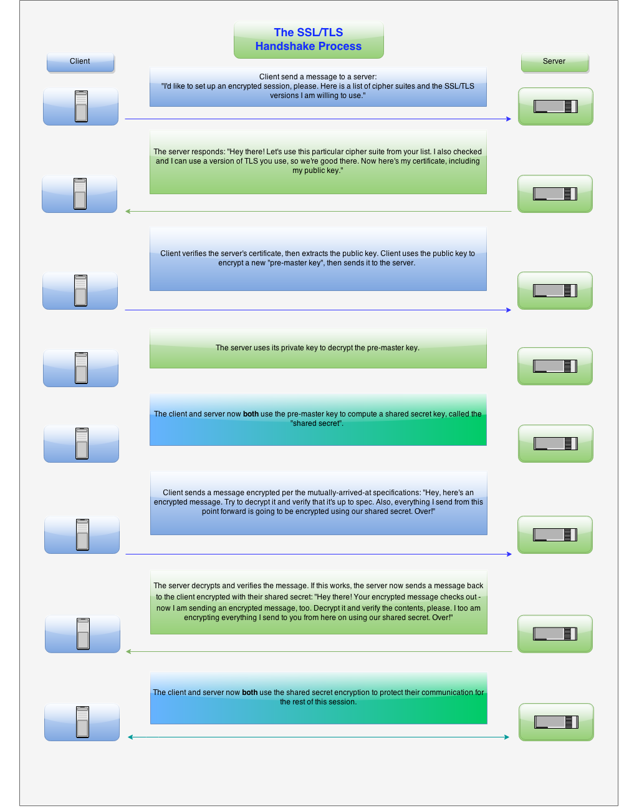

# SSL/TLS

The SSL/TLS protocol encrypts internet traffic of all types, making secure internet communication possible.

## How SSL/TLS works

Encryption is necessary in order to communicate securely over the internet: if your data isn't encrypted, anyone can examine your packets and read confidential information. The safest method of encryption is called asymmetrical cryptography; this requires two cryptographic keys — pieces of information, usually very large numbers — to work properly, one public and one private.

Because asymmetrical cryptography involves these difficult mathematical problems, it takes a lot of computing resources, so much so that if you used it to encrypt all the information in a communications session, your computer and connection would grind to a halt. TLS gets around this problem by only using asymmetrical cryptography at the very beginning of a communications session to encrypt the conversation the server and client have to agree on a single session key that they'll both use to encrypt their packets from that point forward. Encryption using a shared key is called symmetrical cryptography, and it's much less computationally intensive than asymmetric cryptography. Because that session key was established using asymmetrical cryptography, the communication session as a whole is much more secure than it otherwise would be.

The process by which that sessions key is agreed upon is called a handshake, since it's the moment when the two communicating computers introduce themselves to each other, and it's at the heart of the TLS protocol.

## SSL/TLS handshake process

An SSL/TLS handshake is a negotiation between two parties on a network – such as a browser and web server – to establish the details of their connection. It determines what version of SSL/TLS will be used in the session, which cipher suite will encrypt communication, verifies the server (and sometimes also the client), and establishes that a secure connection is in place before transferring data.

### Server authentication during SSL/TLS handshake

SSL-enabled client software always requires server authentication, or cryptographic validation by a client of the server’s identity. The server sends the client a certificate to authenticate itself. The client uses the certificate to authenticate the identity the certificate claims to represent.

To authenticate the binding between a public key and the server identified by the certificate that contains the public key, an SSL-enabled client must receive a yes answer to the four questions shown in the following figure.

An SSL-enabled client goes through the following steps to authenticate a server’s identity:

1. Is today’s date within the validity period?  
The client checks the server certificate’s validity period. If the current date and time are outside of that range, the authentication process won’t go any further. If the current date and time are within the certificate’s validity period, the client goes on to the next step.
2. Is the issuing CA a trusted CA?  
Each SSL-enabled client maintains a list of trusted CA certificates, represented by the shaded area on the right—hand side of Figure 2–9. This list determines which server certificates the client accepts. If the distinguished name (DN) of the issuing CA matches the DN of a CA on the client’s list of trusted CAs, the answer to this question is yes, and the client goes on to the next step. If the issuing CA is not on the list, the server is not authenticated unless the client can verify a certificate chain ending in a CA that is on the list.
3. Does the issuing CA’s public key validate the issuer’s digital signature?  
The client uses the public key from the CA’s certificate (which it found in its list of trusted CAs in step 2) to validate the CA’s digital signature on the server certificate being presented. If the information in the server certificate has changed since it was signed by the CA or if the CA certificate’s public key doesn’t correspond to the private key used by the CA to sign the server certificate, the client won’t authenticate the server’s identity. If the CA’s digital signature can be validated, the server treats the user’s certificate as a valid “letter of introduction” from that CA and proceeds. At this point, the client has determined that the server certificate is valid.
4. Does the domain name in the server’s certificate match the domain name of the server itself?  
This step confirms that the server is actually located at the same network address specified by the domain name in the server certificate. Although step 4 is not technically part of the SSL protocol, it provides the only protection against a form of security attack known as man-in-the-middle. Clients must perform this step and must refuse to authenticate the server or establish a connection if the domain names don’t match. If the server’s actual domain name matches the domain name in the server certificate, the client goes on to the next step.  
5. The server is authenticated.  
The client proceeds with the SSL handshake. If the client doesn’t get to step 5 for any reason, the server identified by the certificate cannot be authenticated, and the user is warned of the problem and informed that an encrypted and authenticated connection cannot be established. If the server requires client authentication, the server performs the steps described in Client Authentication During SSL Handshake.

## Confusions about SSL/TLS

Some confusion about how SSL/TLS handshakes work is due to the handshake being only the prelude to the actual, secured session itself. Let’s try to address some common points:

### Asymmetric vs symmetric encryption

The handshake itself uses **asymmetric encryption** – two separate keys are used, one public and one private. Since asymmetric encryption systems have much higher overhead, they are not usable to provide full-time, real-world security. Thus, the public key is used for encryption and the private key for decryption during the handshake only, which allows the two parties to confidentially set up and exchange a newly-created “shared key”. The session itself uses this single shared key to perform **symmetric encryption**, and this is what makes a secure connection feasible in actual practice (the overhead is vastly lower). So the full and correct answer to **“Is SSL/TLS encryption asymmetric or symmetric?”** is **“First one, then the other”**.

### What is the "cipher suite"?

A cipher suite is a set of algorithms that help secure a network connection that uses Transport Layer Security (TLS) or its now-deprecated predecessor Secure Socket Layer (SSL). The set of algorithms that cipher suites usually contain include: a key exchange algorithm, a bulk encryption algorithm, and a message authentication code (MAC) algorithm.

The key exchange algorithm is used to exchange a key between two devices. This key is used to encrypt and decrypt the messages being sent between two machines. The bulk encryption algorithm is used to encrypt the data being sent. The MAC algorithm provides data integrity checks to ensure that the data sent does not change in transit. In addition, cipher suites can include signatures and an authentication algorithm to help authenticate the server and or client.

### Basic vs mutually-authenticated handshake

Another confusing point is that the basic model we described above lets the client verify the server, and the vast majority of sessions secured by TLS only require this. However, some cipher suites will require the client to also send a certificate and public key for mutual authentication of both parties. This two-way authentication will of course add overhead to the handshake – however, in some cases (for instance, where two banks are negotiating a secure connection for fund transfers) the cipher suite will insist upon it, and the extra security is deemed worth it.

### Different sessions will have different security parameters

Each new handshake creates a new session, and the settings used in one can differ drastically from another depending on the cipher suite chosen.  This is among the reasons so many different iterations of that darned handshake chart exist, and why we are giving a fairly broad overview here. Also know that sessions can set parameters that may not be exactly what you expect. Depending on the cipher suite, some steps may be added (like the requirement for two-way authentication) or absent. In fact, there are actually cipher suites that negotiate a session to use no encryption whatsoever. (Yeah, we know, an HTTPS connection over port 443 which decides to send data in the clear makes no sense to us either)

## References

- [SSL/TLS handshake overview](https://www.ssl.com/article/ssl-tls-handshake-overview)
- [What is SSL, TLS? And how this encryption protocol works](https://www.csoonline.com/article/3246212/what-is-ssl-tls-and-how-this-encryption-protocol-works.html)
- [Server authentication during SSL/TLS handshake](https://docs.oracle.com/cd/E19693-01/819-0997/aakhc/index.html)