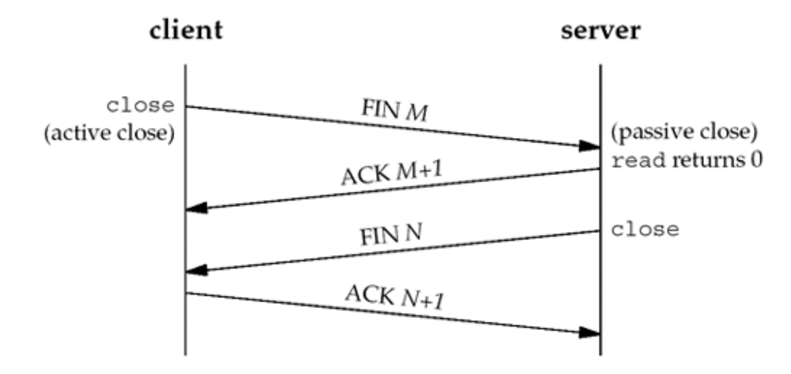
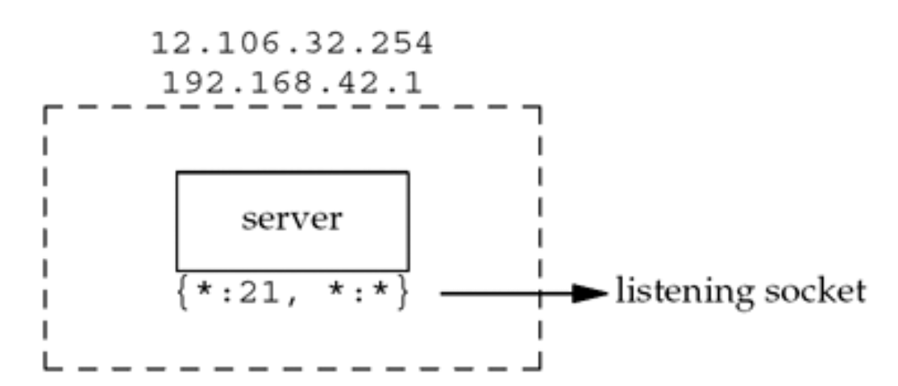
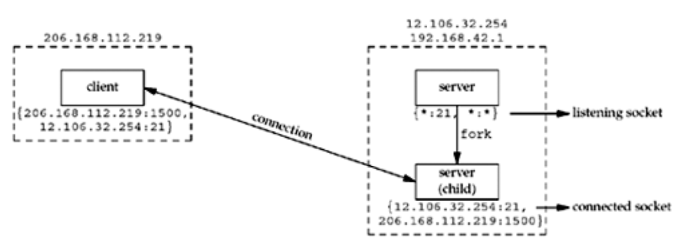
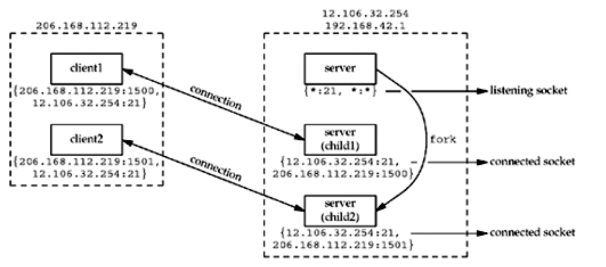

# Transport Layer

## Socket and Socket Pair

A *socket* is the combination of IP address and port. The *socket pair* for a TCP connection is the four-tuple that defines the two endpoints of the connection: the local IP address, local port, foreign IP address, and foreign port. A socket pair uniquely identifies every TCP connection on a network.

## User Datagram Protocol - UDP

UDP is a simple transport-layer protocol. The application writes a message to a UDP socket, which is then encapsulated in a UDP datagram, which is then further encapsulated as an IP datagram, which is then sent to its destination. There is no guarantee that a UDP datagram will ever reach its final destination, that order will be preserved across the network, or that datagrams arrive only once.

The problem that we encounter with network programming using UDP is its lack of reliability. If a datagram reaches its final destination but the checksum detects an error, or if the datagram is dropped in the network, it is not delivered to the UDP socket and is not automatically retransmitted. If we want to be certain that a datagram reaches its destination, we can build lots of features into our application: acknowledgments from the other end, timeouts, retransmissions, and the like.

Each UDP datagram has a length. The length of a datagram is passed to the receiving application along with the data. We have already mentioned that TCP is a byte-stream protocol, without any record boundaries at all, which differs from UDP.

We also say that UDP provides a connectionless service, as there need not be any long-term relationship between a UDP client and server. For example, a UDP client can create a socket and send a datagram to a given server and then immediately send another datagram on the same socket to a different server. Similarly, a UDP server can receive several datagrams on a single UDP socket, each from a different client.

## Tranmission Control Protocol - TCP

First, TCP provides connections between clients and servers. A TCP client establishes a connection with a given server, exchanges data with that server across the connection, and then terminates the connection.

TCP also provides reliability. When TCP sends data to the other end, it requires an acknowledgment in return. If an acknowledgment is not received, TCP automatically retransmits the data and waits a longer amount of time. After some number of retransmissions, TCP will give up, with the total amount of time spent trying to send data typically between 4 and 10 minutes (depending on the implementation).

> Note that TCP does not guarantee that the data will be received by the other endpoint, as this is impossible. It delivers data to the other endpoint if possible, and notifies the user (by giving up on retransmissions and breaking the connection) if it is not possible. Therefore, TCP cannot be described as a 100% reliable protocol; it provides reliable delivery of data or reliable notification of failure.

TCP contains algorithms to estimate the round-trip time (RTT) between a client and server dynamically so that it knows how long to wait for an acknowledgment. For example, the RTT on a LAN can be milliseconds while across a WAN, it can be seconds. Furthermore, TCP continuously estimates the RTT of a given connection, because the RTT is affected by variations in the network traffic.

TCP also sequences the data by associating a sequence number with every byte that it sends. If the segments out of order, the receiving TCP will reorder the two segments based on their sequence numbers before passing the data to the receiving application. If TCP receives duplicate data from its peer (say the peer thought a segment was lost and retransmitted it, when it wasn't really lost, the network was just overloaded), it can detect that the data has been duplicated (from the sequence numbers), and discard the duplicate data.

> There is no reliability provided by UDP. UDP itself does not provide anything like acknowledgements, sequence numbers, RTT estimation, timeouts, or retransmissions. If a UDP datagram is duplicaetd in the network, two copies can be delivered to the receiving host. Also, if a UDP client sends two datagrams to the same destination, they can be reordered by the network and arrive out of order. UDP applications must handle all these cases.

TCP provides flow control. TCP always tells its peer exactly how many bytes of data it is willing to accept from the peer at any one time. This is called the advertised window. At any time, the window is the amount of room currently available in the receive buffer, guaranteeing that the sender cannot overflow the receive buffer. The window changes dynamically over time: As data is received from the sender, the window size decreases, but as the receiving application reads data from the buffer, the window size increases. It is possible for the window to reach 0: when TCP's receive buffer for a socket is full and it must wait for the application to read data from the buffer before it can take any more data from the peer.

> UDP provides no flow control. It is easy for a fast UDP sender to transmit datagrams at a rate that the UDP receiver cannot keep up with.

Finally, a TCP connection is full-duplex. This means that an appliaction can send adn receive data in both directions on a given connection at any time. This means that TCP must keep track of state information such as sequence numbers and window sizes for each direction of data flow: sending and receiving. After a full-duplex connection is established, it can be turned into a simplex connection if desired.

> UDP can be full-duplex, too.

## TCP Connection Establishment and Termination

### Connection Establishment - Three-Way Handshake

The following scenario occurs when a TCP connection is established:

1. The server must be prepared to accept an incoming connection. This is normally done by
callingsocket,bind, and listen and is called a passive open.
2. The client issues an active open by calling connect. This causes the client TCP to send a "synchronize" (SYN) segment, which tells the server the client's initial sequence number for the data that the client will send on the connection. Normally, there is no data sent with the SYN; it just contains an IP header, a TCP header, and possible TCP options (which we will talk about shortly).
3. The server must acknowledge (ACK) the client's SYN and the server must also send its own SYN containing the initial sequence number for the data that the server will send on the connection. The server sends its SYN and the ACK of the client's SYN in a single segment.
4. The client must acknowledge the server's SYN.

> <a href="https://stackoverflow.com/questions/34073871/socket-programming-whats-the-difference-between-listen-and-accept">What is the difference between listen and accept?</a>

We show the client's initial sequence number as J and the server's initial sequence number as K. The acknowledgment number in an ACK is the next expected sequence number for the end sending the ACK. **Since a SYN occupies one byte of the sequence number space, the acknowledgment number in the ACK of each SYN is the initial sequence number plus one**. Similarly, the ACK of each FIN is the sequence number of the FIN plus one.

> An everyday analogy for establishing a TCP connection is the telephone system. The socket function is the equivalent of having a telephone to use. `bind` is telling other people your telephone number so that they can call you. `listen` is turning on the ringer so that you will hear when an incoming call arrives. `connect` requires that we know the other person's phone number and dial it. `accept` is when the person being called answers the phone. Having the client's identity returned by `accept` (where the identify is the client's IP address and port number) is similar to having the caller ID feature show the caller's phone number. One difference, however, is that `accept` returns the client's identity only after the connection has been established, whereas the caller ID feature shows the caller's phone number before we choose whether to answer the phone or not. If the DNS is used (Chapter 11), it provides a service analogous to a telephone book. `getaddrinfo` is similar to looking up a person's phone number in the phone book. `getnameinfo` would be the equivalent of having a phone book sorted by telephone numbers that we could search, instead of a book sorted by name.

### Connection Termination

While it takes three segments to establish a connection, it takes four to terminate a connection.

1. One application calls close first, and we say that this end performs the active close. This end's TCP sends a FIN segment, which means it is finished sending data.
2. The other end that receives the FIN performs the passive close. The received FIN is acknowledged by TCP. The receipt of the FIN is also passed to the application as an endof-file (after any data that may have already been queued for the application to receive), since the receipt of the FIN means the application will not receive any additional data on the connection.
3. Sometime later, the application that received the end-of-file will close its socket. This
causes its TCP to send a FIN.
4. The TCP on the system that receives this final FIN (the end that did the active close)
acknowledges the FIN.

Since a FIN and an ACK are required in each direction, four segments are normally required. We use the qualifier "normally" because in some scenarios, the FIN in Step 1 is sent with data. Also, the segments in Steps 2 and 3 are both from the end performing the passive close and could be combined into one segment.

A FIN occupies one byte of the sequence number space just like SYN. Therefore, the ACK of each FIN is the sequence number of the FIN plus one.

Between step 2 and 3, it is possible for data to flow from the end doing the passive close to the end doing the active close. The his called a half-close and we will talk about this in detail with the `shutdown` function.

The sending of each FIN occurs when a socket is closed. We indicated that the application calls `close` for this to happen, but realize that when a Unix process terminates, either voluntarily (calling exit or having the main function return) or involuntarily (receiving a signal that terminates the process), all open descriptors are closed, which will also cause a FIN to be sent on any TCP connection that is still open.

Either the client or the server can perform the active close. Often the client performs the active close, but with some protocols (notably HTTP/1.0), the server performs the active close.

## TCP Port Numbers and Concurrent Servers

With a concurrent server, where the main server loop spawns a child to handle each new connection, what happens if the child continues to use the well-known port number while servicing a long request? Let's examine a typical sequence. First, the server is started on the hostfreebsd, which is multihomed with IP addresses 12.106.32.254 and 192.168.42.1, and the server does a passive open using its well-known port number (21, for this example). It is now waiting for a client request, which we show in the figure below.

We use the notation {\*:21, \*:\*} to indicate the server's socket pair. The server is waiting for a connection request on any local interface (the first asterisk) on port 21. The foreign IP address and foreign port are not specified and we denote them as \*:\*. We also call this a listening socket.

When we specify the local IP address as an asterisk, it is called the wildcard character. If the host on which the server is running is multihomed (as in this example), the server can specify that it wants only to accept incoming connections that arrive destined to one specific local interface. This is a one-or-any choice for the server. The server cannot specify a list of multiple addresses. The wildcard local address is the "any" choice.

At some later time, a client starts on the host with IP address 206.168.112.219 and executes an active open to the server's IP address of 12.106.32.254. We assume the ephemeral port chosen by the client TCP is 1500 for this example. This is shown in figure below. Beneath the client we show its socket pair.

When the server receives and accepts the client's connection, it forks a copy of itself, letting
the child handle the client, as we show in figure below.

At this point, we must distinguish between the listening socket and the connected socket on the server host. Notice that the connected socket uses the same local port (21) as the listening socket. Also notice that on the multihomed server, the local address is filled in for the connected socket (12.106.32.254) once the connection is established.

The next step assumes that another client process on the client host requests a connection with the same server. The TCP code on the client host assigns the new client socket an unused ephemeral port number, say 1501. This gives us the scenario shown in figure below. On the server, the two connections are distinct: the socket pair for the first connection differs from the socket pair for the second connection because the client's TCP chooses an unused port for the second connection (1501).

Notice from this example that TCP cannot demultiplex incoming segments by looking at just the destination port number. TCP must look at all four elements in the socket pair to determine which endpoint receives an arriving segment. In figure above, we have three sockets with the same local port (21). If a segment arrives from 206.168.112.219 port 1500 destined for 12.106.32.254 port 21, it is delivered to the first child. If a segment arrives from 206.168.112.219 port 1501 destined for 12.106.32.254 port 21, it is delivered to the second child. All other TCP segments destined for port 21 are delivered to the original server with the listening socket.

## References

- [Build Web Application with Go - Socket](https://astaxie.gitbooks.io/build-web-application-with-golang/content/en/08.1.html)
- [Can two different sockets share a port?](https://stackoverflow.com/questions/11129212/tcp-can-two-different-sockets-share-a-port/11129641)
- [UNIX Network Programming - Socket Pair](https://books.google.com.vn/books?id=ptSC4LpwGA0C&lpg=PA52&dq=socket+pair+tuple&pg=PA52&redir_esc=y#v=onepage&q=socket%20pair%20tuple&f=false)
- [TCP/IP Ports and Sockets Explained](http://www.steves-internet-guide.com/tcpip-ports-sockets/)