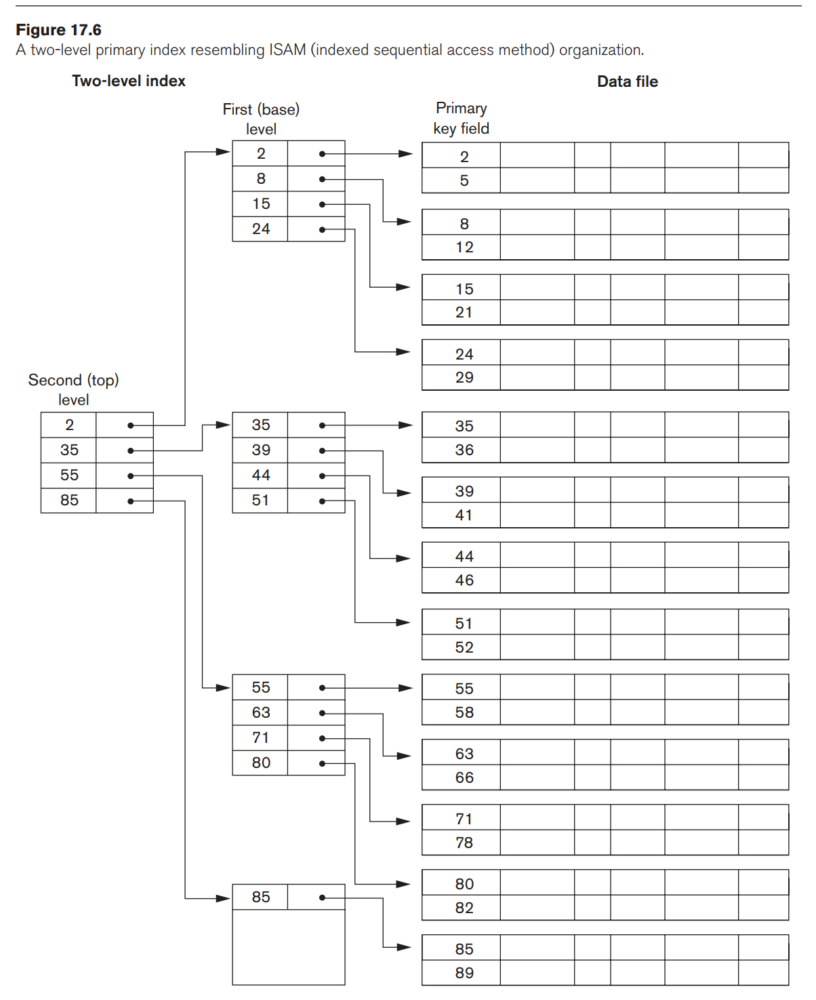

# Indexing

## Single-Level Ordered Indexes

- **Primary index**: specified on the ordering key field of an ordered file of records
- **Clustering index**: specified on the ordering non-key field of an ordered file of records
- A file can have at most one physical ordering field, so it can have **either primary index or clustering index**
- **Secondary index**: specified on a field that is a candidate key and has a unique value in every record, or on a nonkey field with duplicate values

## Multi-Level Indexes

Use B-Tree and B+-Tree for better searching

