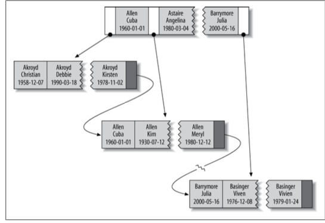
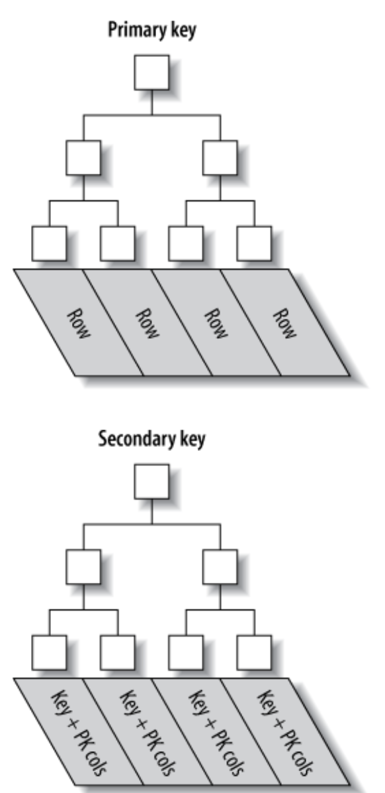

# Indexing for High Performance

## Indexing Basics

### Types of Indexes

There are many types of indexes, each designed to perform well for different purposes. Indexes are implemented in the storage engine layer, not the server layer. Thus, they are not standardized: indexing works slightly differently in each engine, and not all engines support all types of indexes.

#### B-Tree Indexes

Storage engines use B-Tree indexes in various ways, which can affect performance. For instance, MyISAM uses a prefix compression technique that makes indexes smaller, but InnoDB leaves values uncompressed in its indexes. Also, MyISAM indexes refer to the indexed rows by their physical storage locations, but InnoDB refers to them by their primary key values. Each variation has benefits and drawbacks.

Because B-Trees store the indexed columns in order, they’re useful for searching for ranges of data. For instance, descending the tree for an index on a text field passes through values in alphabetical order, so looking for “everyone whose name begins with I through K” is efficient.

Suppose you have the following table:

```sql
CREATE TABLE people (
    last_name varchar(50) not null,
    first_name varchar(50) not null,
    dob date not null,
    gender enum('m', 'f')not null,
    key(last_name, first_name, dob) 
);
```

The index will contain the values from the last_name, first_name, and dob columns for every row in the table. Figure 5-2 illustrates how the index arranges the data it stores.



**Types of queries that can use a B-Tree index.** B-Tree indexes work well for lookups by the full key value, a key range, or a key prefix. They are useful only if the lookup uses a leftmost prefix of the index.3 The index we showed in the previous section will be useful for the following kinds of queries:

- Match the full value: A match on the full key value specifies values for all columns in the index. For example, this index can help you find a person named Cuba Allen who was born on 1960-01-01.
- Match a leftmost prefix:
This index can help you find all people with the last name Allen. This uses only the first column in the index.
- Match a column prefix:
You can match on the first part of a column’s value. This index can help you find all people whose last names begin with J. This uses only the first column in the index.
- Match a range of values:
This index can help you find people whose last names are between Allen and Bar- rymore. This also uses only the first column.
- Match one part exactly and match a range on another part: This index can help you find everyone whose last name is Allen and whose first name starts with the letter K (Kim, Karl, etc.). This is an exact match on last_ name and a range query on first_name.
- Index-only queries:
B-Tree indexes can normally support index-only queries, which are queries that access only the index, not the row storage. This is called **Covering Indexes".

Because the tree’s nodes are sorted, they can be used for both lookups (finding values) and ORDER BY queries (finding values in sorted order). In general, if a B-Tree can help you find a row in a particular way, it can help you sort rows by the same criteria. So, our index will be helpful for ORDER BY clauses that match all the types of lookups we just listed.

Here are some limitations of B-Tree indexes:

- They are not useful if the lookup does not start from the leftmost side of the indexed columns. For example, this index won’t help you find all people named Bill or all people born on a certain date, because those columns are not leftmost in the index. Likewise, you can’t use the index to find people whose last name ends with a par- ticular letter.
- You can’t skip columns in the index. That is, you won’t be able to find all people whose last name is Smith and who were born on a particular date. If you don’t specify a value for the first_name column, MySQL can use only the first column of the index.
- The storage engine can’t optimize accesses with any columns to the right of the first range condition. For example, if your query is WHERE last_name="Smith" AND first_name LIKE 'J%' AND dob='1976-12-23', the index access will use only the first two columns in the index, because the LIKE is a range condition (the server can use the rest of the columns for other purposes, though). For a column that has a limited number of values, you can often work around this by specifying equality conditions instead of range conditions. We show detailed examples of this in the indexing case study later in this chapter.

#### Hash indexes

A hash index is built on a hash table and is useful only for exact lookups that use every column in the index.4 For each row, the storage engine computes a hash code of the indexed columns, which is a small value that will probably differ from the hash codes computed for other rows with different key values. It stores the hash codes in the index and stores a pointer to each row in a hash table.

In MySQL, only the Memory storage engine supports explicit hash indexes. They are the default index type for Memory tables, though Memory tables can have B-Tree in- dexes, too. The Memory engine supports nonunique hash indexes, which is unusual in the database world. If multiple values have the same hash code, the index will store their row pointers in the same hash table entry, using a linked list.

Because the indexes themselves store only short hash values, hash indexes are very compact. As a result, lookups are usually lightning fast. However, hash indexes have some limitations:
- Because the index contains only hash codes and row pointers rather than the values themselves, MySQL can’t use the values in the index to avoid reading the rows. Fortunately, accessing the in-memory rows is very fast, so this doesn’t usually de- grade performance.
- MySQL can’t use hash indexes for sorting because they don’t store rows in sorted order.
- Hash indexes don’t support partial key matching, because they compute the hash from the entire indexed value. That is, if you have an index on (A,B) and your query’s WHERE clause refers only to A, the index won’t help.
- Hash indexes support only equality comparisons that use the =, IN(), and <=> operators (note that <> and <=> are not the same operator). They can’t speed up range queries, such as WHERE price > 100.
- Accessing data in a hash index is very quick, unless there are many collisions (mul- tiple values with the same hash)- When there are collisions, the storage engine must follow each row pointer in the linked list and compare their values to the lookup value to find the right row(s).
- Some index maintenance operations can be slow if there are many hash collisions. For example, if you create a hash index on a column with a very low selectivity (many hash collisions) and then delete a row from the table, finding the pointer from the index to that row might be expensive. The storage engine will have to examine each row in that hash key’s linked list to find and remove the reference to the one row you deleted.

#### Spatial (R-Tree) indexes
MyISAM supports spatial indexes, which you can use with partial types such as GEOME TRY. Unlike B-Tree indexes, spatial indexes don’t require your WHERE clauses to operate on a leftmost prefix of the index. They index the data by all dimensions at the same time. As a result, lookups can use any combination of dimensions efficiently.

#### Full-text indexes

**FULLTEXT** is a special type of index that finds keywords in the text instead of comparing values directly to the values in the index. Full-text searching is completely different from other types of matching. It has many subtleties, such as stopwords, stemming and plurals, and Boolean searching. It is much more analogous to what a search engine does than to simple **WHERE** parameter matching.

Having a full-text index on a column does not eliminate the value of a B-Tree index on the same column. Full-text indexes are for **MATCH AGAINST** operations, not ordinary **WHERE** clause operations.

## Indexing Strategies for High Performance

### Isolating the Column

We commonly see queries that defeat indexes or prevent MySQL from using the avail- able indexes. MySQL generally can’t use indexes on columns unless the columns are isolated in the query. “Isolating” the column means it should not be part of an expres- sion or be inside a function in the query.

For example, here’s a query that can’t use the index on actor_id: 

```sql
SELECT actor_id FROM sakila.actor WHERE actor_id + 1 = 5;
```

A human can easily see that the WHERE clause is equivalent to actor_id = 4,butMySQL can’t solve the equation for actor_id. It’s up to you to do this. You should get in the habit of simplifying your WHERE criteria, so the indexed column is alone on one side of the comparison operator.

Here’s another example of a common mistake:

```sql
SELECT ... WHERE TO_DAYS(CURRENT_DATE) - TO_DAYS(date_col) <= 10;
```

### Multiplecolumn Indexes

When use index many or all of the columns separately, or to index columns in the wrong order, query optimizer use a strategy call *index merge*.

For example, the film_actor table has an index on film_id and an index on actor_id, but neither is a good choice for both WHERE conditions in this query:

```sql
SELECT film_id, actor_id FROM sakila.film_actor WHERE actor_id = 1 OR film_id = 1;
```

In older MySQL versions, that query would produce a table scan unless you wrote it as the UNION of two queries:

```sql
SELECT film_id, actor_id FROM sakila.film_actor WHERE actor_id = 1
UNION ALL
SELECT film_id, actor_id FROM sakila.film_actor WHERE film_id = 1  AND actor_id <> 1;
```

In MySQL 5.0 and newer, however, the query can use both indexes, scanning them simultaneously and merging the results. There are three variations on the algorithm: union for OR conditions, intersection for AND conditions, and unions of intersections for combinations of the two.

The index merge strategy sometimes works very well, but it’s more common for it to
actually be an indication of a poorly indexed table:
- When the server intersects indexes (usually for AND conditions), it usually means that you need a single index with all the relevant columns, not multiple indexes that have to be combined.
- When the server unions indexes (usually for OR conditions), sometimes the algo- rithm’s buffering, sorting, and merging operations use lots of CPU and memory resources. This is especially true if not all of the indexes are very selective, so the scans return lots of rows to the merge operation.
- Recall that the optimizer doesn’t account for this cost—it optimizes just the num- ber of random page reads. This can make it “underprice” the query, which might in fact run more slowly than a plain table scan. The intensive memory and CPU usage also tends to impact concurrent queries, but you won’t see this effect when you run the query in isolation. Sometimes rewriting such queries with a UNION, the way you used to have to do in MySQL 4.1 and earlier, is more optimal.

### Choosing a Good Column Order

Placing the most selective columns first can be a good idea when there is no sorting or grouping to consider, and thus the purpose of the index is only to optimize WHERE lookups. In such cases, it might indeed work well to design the index so that it filters out rows as quickly as possible, so it’s more selective for queries that specify only a prefix of the index in the WHERE clause.

### Clustered Indexes

Clustered indexes aren’t a separate type of index. Rather, they’re an approach to data storage. The exact details vary between implementations, but InnoDB’s clustered in- dexes actually store a B-Tree index and the rows together in the same structure.

When a table has a clustered index, rows are actually stored in the index’s leaf pages. Each node in B-Tree contains two data: the row's primary key (serves as key for B-Tree node) and the rest data of the row.

Whereas in **secondary indexes** (every indexes which aren't clustered indexes), primary keys are stored in the index's leaf pages. Each node in B-Tree contains two data: the data of indexed columns for this row (serves as key for B-Tree ndoe) and the row's primary key.

> *Why InnoDB doesn't store pointer to the row address in secondary indexes?*  
It reduces the work needed to maintain secondary indexes when rows move or when there’s a data page split. Using the row’s primary key values as the pointer makes the index larger, but it means InnoDB can move a row without updating pointers to it.



The term “clustered” refers to the fact that rows with adjacent key values are stored close to each other. You can have only one clustered index per table, because you can’t store the rows in two places at once.

If you don’t define a primary key, InnoDB will try to use a unique nonnullable index instead. If there’s no such index, InnoDB will define a hidden primary key for you and then cluster on that. InnoDB clusters records together only within a page. Pages with adjacent key values might be distant from each other.

Clustering data has some very important advantages:
- You can keep related data close together. For example, when implementing a mailbox, you can cluster by user_id, so you can retrieve all of a single user’s mes- sages by fetching only a few pages from disk. If you didn’t use clustering, each message might require its own disk I/O.
- Data access is fast. A clustered index holds both the index and the data together in one B-Tree, so retrieving rows from a clustered index is normally faster than a comparable lookup in a nonclustered index.
- Queries that use covering indexes can use the primary key values contained at the leaf node.

These benefits can boost performance tremendously if you design your tables and queries to take advantage of them. However, clustered indexes also have disadvantages:
- Clustering gives the largest improvement for I/O-bound workloads. If the data fits in memory the order in which it’s accessed doesn’t really matter, so clustering doesn’t give much benefit.
- Insert speeds depend heavily on insertion order. Inserting rows in primary key order is the fastest way to load data into an InnoDB table. It might be a good idea toreorganizethetablewithOPTIMIZE TABLEafterloadingalotofdataifyoudidn’t load the rows in primary key order.
- Updating the clustered index columns is expensive, because it forces InnoDB to move each updated row to a new location.
- Tables built upon clustered indexes are subject to page splits when new rows are inserted, or when a row’s primary key is updated such that the row must be moved. A page split happens when a row’s key value dictates that the row must be placed into a page that is full of data. The storage engine must split the page into two to accommodate the row. Page splits can cause a table to use more space on disk.
- Clustered tables can be slower for full table scans, especially if rows are less densely packed or stored nonsequentially because of page splits.
- Secondary (nonclustered) indexes can be larger than you might expect, because their leaf nodes contain the primary key columns of the referenced rows.
- Secondary index accesses require two index lookups instead of one.

The last point can be a bit confusing. Why would a secondary index require two index lookups? The answer lies in the nature of the “row pointers” the secondary index stores. Remember, a leaf node doesn’t store a pointer to the referenced row’s physical location; rather, it stores the row’s primary key values.

That means that to find a row from a secondary index, the storage engine first finds the leaf node in the secondary index and then uses the primary key values stored there to navigate the primary key and find the row. That’s double work: two B-Tree navigations instead of one. In InnoDB, the adaptive hash index can help reduce this penalty.

### Covering Indexes

Indexes need to be designed for the whole query, not just the WHERE clause. Indexes are indeed a way to find rows efficiently, but MySQL can also use an index to retrieve a column’s data, so it doesn’t have to read the row at all. After all, the index’s leaf nodes contain the values they index; why read the row when reading the index can give you the data you want? An index that contains (or “covers”) all the data needed to satisfy a query is called a covering index.

Covering indexes can be a very powerful tool and can dramatically improve perfor- mance. Consider the benefits of reading only the index instead of the data:

- Index entries are usually much smaller than the full row size, so MySQL can access significantly less data if it reads only the index. 
- Indexes are sorted by their index values (at least within the page), so I/O-bound range accesses will need to do less I/O compared to fetching each row from a random disk location.
- Covering indexes are especially helpful for InnoDB tables, because of InnoDB’s clustered indexes. InnoDB’s secondary indexes hold the row’s primary key values at their leaf nodes. Thus, a secondary index that covers a query avoids another index lookup in the primary key.