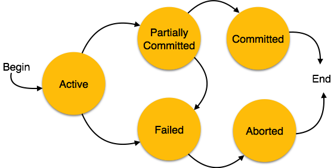

# Transaction

## ACID Properties

- **Atomicity** − This property states that a transaction must be treated as an atomic unit, that is, either all of its operations are executed or none. There must be no state in a database where a transaction is left partially completed. States should be defined either before the execution of the transaction or after the execution/abortion/failure of the transaction.

- **Consistency** − The database must remain in a consistent state after any transaction. No transaction should have any adverse effect on the data residing in the database. If the database was in a consistent state before the execution of a transaction, it must remain consistent after the execution of the transaction as well.

  > Consistency in database systems refers to the requirement that any given database transaction must change affected data only in allowed ways. Any data written to the database must be valid according to all defined rules, including constraints, cascades, triggers, and any combination thereof.

- **Durability** − The database should be durable enough to hold all its latest updates even if the system fails or restarts. If a transaction updates a chunk of data in a database and commits, then the database will hold the modified data. If a transaction commits but the system fails before the data could be written on to the disk, then that data will be updated once the system springs back into action.

- **Isolation** − In a database system where more than one transaction are being executed simultaneously and in parallel, the property of isolation states that all the transactions will be carried out and executed as if it is the only transaction in the system. No transaction will affect the existence of any other transaction.

### State of Transactions

- **Active**: In this state, the transaction is being executed. This is the initial state of every transaction.

- **Partially Committed**: When a transaction executes its final operation, it is said to be in a partially committed state.

- **Failed**: A transaction is said to be in a failed state if any of the checks made by the database recovery system fails. A failed transaction can no longer proceed further.

- **Aborted**: If any of the checks fails and the transaction has reached a failed state, then the recovery manager rolls back all its write operations on the database to bring the database back to its original state where it was prior to the execution of the transaction. Transactions in this state are called aborted. The database recovery module can select one of the two operations after a transaction aborts
  - Re-start the transaction
  - Kill the transaction

- **Committed**: If a transaction executes all its operations successfully, it is said to be committed. All its effects are now permanently established on the database system.
