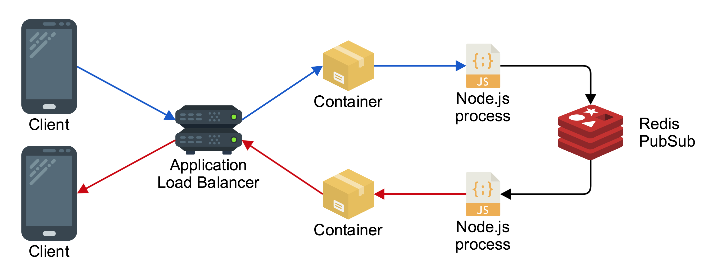

# WebSocket

WebSocket is a computer communications protocol, providing full-duplex communication channels over a single TCP connection.

WebSocket is distinct from HTTP. Both protocols are located at layer 7 in the OSI model and depend on TCP at layer 4. Although they are different, RFC 6455 states that WebSocket "is designed to work over HTTP ports 443 and 80 as well as to support HTTP proxies and intermediaries," thus making it compatible with the HTTP protocol. To achieve compatibility, the WebSocket handshake uses the HTTP Upgrade header to change from the HTTP protocol to the WebSocket protocol. The handshake request header may look something like:

```http
GET /chat HTTP/1.1
Host: example.com:8000
Upgrade: Websocket
Connection: Upgrade
Sec-WebSocket-Key: dGhlIHNhbXBsZSBub25jZQ==
Sec-WebSocket-Version: 13
```

The WebSocket protocol enables interaction between a web browser (or other client application) and a web server with lower overhead than half-duplex alternatives such as HTTP polling, facilitating real-time data transfer from and to the server. This is made possible by providing a standardized way for the server to send content to the client without being first requested by the client, and allowing messages to be passed back and forth while keeping the connection open. In this way, a two-way ongoing conversation can take place between the client and the server. The communications are usually done over TCP port number 443 (or 80 in the case of unsecured connections), which is of benefit for those environments which block non-web Internet connections using a firewall.

## WebSocket vs. HTTP

| Criteria | HTTP | WebSocket |
|----------|------|-----------|
| Duplex | Half-duplex | Full-duplex |
| Messaging pattern | Request-response | Bi-directional |
| Server push | Not natively supported. <br/> Client polling or streaming download techniques used | Core feature |
| Overhead | Moderate overhead per request/connection | Moderate overhead to establish & maintain the connection, then minimal overhead per message |
| Intermediary / Edge Caching | Core feature | Not possible |
| Supported clients | Broad support | Modern languages & clients |

## WebSocket Authentication

### Authentication on Handshake

If you’re using websockets for authenticated users, it is a pretty good idea to only allow authenticated users to establish a successful websocket connection. Don’t allow anyone to establish a connection and then wait for them to authenticate over the websocket itself. First of all, establishing a websocket connection is a bit expensive anyway. So you don’t want unauthorized people hopping on your websockets and hogging connections which could be used by other people.

To do this, when you’re establishing a connection on frontend, pass some authentication data to websocket. It could be a header like X-Auth-Token: \<some token assigned to this client on login\>. By default, cookies would be passed anyway.

### Explicit Authentication Message

In this strategy the message that causes the connection to be considered authenticated has a special type that indicates that the client is proving it's identity. The payload of this message includes the JWT provided by the trusted identity provider. The server is then able to process this message, validate the token and connect that connection with the identity of the client.

WebSockets are a stateful protocol and the server needs to hold information about the clients connected to it, and I don't see a reason why storing data about the authentication would be less secure as long as you're not storing the actual JWT.

### Authentication In Each Message

The second strategy is to include authentication in each message. In this model the client adds a property to the sent object that includes the JWT. The server then processes that JWT as part of the message handing and updates it's data store to represent the current state of the connections authentication.

The case for Authentication In Each Message is when the order of processing cannot be guaranteed. While WebSockets are a stateful protocol there is nothing enforcing that the thing terminating the WebSocket is the same thing that is processing the message. Messages may be put onto a queue or passed off to a load balanced set of handlers. In this case including authentication tokens in each message may be simpler than orchestrating an authentication process before messages can be sent.

## WebSocket Secure

If an encrypted WebSocket connection is used, then the use of Transport Layer Security (TLS) in the WebSocket Secure connection ensures that an HTTP CONNECT command is issued when the browser is configured to use an explicit proxy server. This sets up a tunnel, which provides low-level end-to-end TCP communication through the HTTP proxy, between the WebSocket Secure client and the WebSocket server.

## Horizontal Scaling



## References

- [Web API design](https://medium.com/platform-engineer/web-api-design-35df8167460)
- [How WebSocket is implemented?](https://stackoverflow.com/questions/34730334/how-websockets-are-implemented)
- [HTTP/1.1 Upgrade header](https://en.wikipedia.org/wiki/HTTP/1.1_Upgrade_header)
- [Authenticating WebSocket](https://dev.to/kleeut/authenticating-websockets-21lo)
- [How to secure your websocket connection?](https://www.freecodecamp.org/news/how-to-secure-your-websocket-connections-d0be0996c556/)
