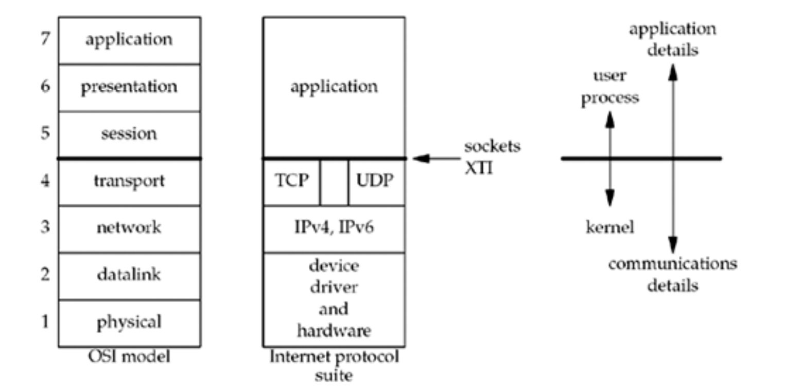

# OSI Model

The function of each layer:

- Application: facilitates the user to use the services of the network
- Transport: route application protocols to the correct application on the destination computer
- Network: send and route packets from one node to others across multiple networks
- Datalink: deliver packets between two node in the same network
- Physical: send bit from one node to another

We consider the bottom two layers of the OSI model as the device driver and networking hardware that are supplied with the system.

The network layer is handled by the IPv4 and IPv6 protocols. The transport layers that we can choose from the TCP and UDP. There is a gap between TCP and UDP to indicate that **it is possible for an application to bypass the transport layer and use IPv4 or IPv6 directly**. This is called raw socket, more information [here](https://docs.microsoft.com/en-us/windows/win32/winsock/tcp-ip-raw-sockets-2).

The upper three layers of the OSI model are combined into a single layer called the application. This is the Web client (browser), Telnet client, Web server, FTP server, or whatever application we are using. With the Internet protocols, there is rarely any distinction between the upper three layers of the OSI model.

The socket programming interfaces described are interaces from upper three layers (the "application") into the transport layer. Why do sockets provide the interface from the upper three layers of the OSI model into the transport layer? There are two reasons for this design. First, the upper three layers handle all the details of the application (FTP, Telnet, or HTTP, for example) and know little about the communication details. The lower four layers know little about the application, but handle all the communication detais: sending data, waiting for acknowledgements, sequencing data that arrives out of order, calculating and verifying checksums, and so on. The second reason is that the upper three layers often from that is called a *user process* while  the lower four  layers are normally provided as part of the operating system kernel. Unix provides this seperation between the user process and the kernel, as do many other contemporary operating systems. Therefore, the interface between layers 4 and 5 is the natural place to build the API.

## Related

- [Baeldung - OSI Model](https://www.baeldung.com/cs/osi-model)
