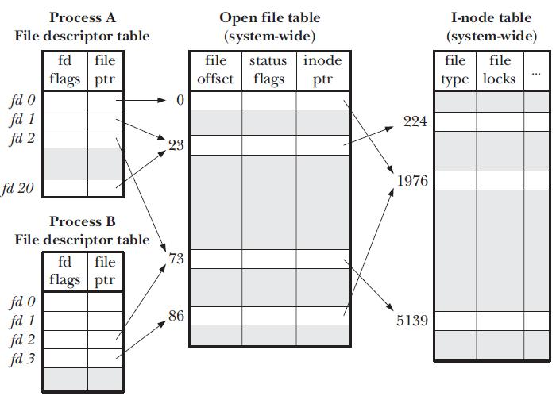

# File & Filesystem

## Filesystem

- Responsible for laying out data on a persistent storage device and ensureing that the data can be retrieved reliably
- Abstraction of disk space:
  - Methods for querying, opening, and closing files
  - Human-readable names for files
  - Organization of files into directories
- Arbitrator of disk space:
  - File permissions provide privacy from other users
  - Qoutas ensure single users do not take all space

## File Concept

- The operating system abstracts from the physical properties of its storage devices to define a logical storage unit, the file. Files are mapped by the operating system onto physical devices
- A file is a named collection of related information that is recorded on secondary storage. From a user’s perspective, a file is the smallest allotment of logical secondary storage; that is, data cannot be written to secondary storage unless they are within a file

## Operations on File

- **Creating a file**: Two steps are necessary to create a file. First, space in the file system must be found for the file. Second, an entry for the new file must be made in the directory
- **Writing a file**: To write a file, we make a system call specifying both the name of the file and the information to be written to the file. Given the name of the file, the system searches the directory to find the file’s location. The system must keep a write pointer to the location in the file where the next write is to take place. The write pointer must be updated whenever a write occurs
- **Reading a file**:  To read from a file, we use a system call that specifies the name of the file and where (in memory) the next block of the file should be put. Again, the directory is searched for the associated entry, and the system needs to keep a read pointer to the location in the file where the next read is to take place. Because a process is usually either reading from or writing to a file, the current operation location can be kept as a per-process currentfile-position pointer
- **Repositioning within a file**: The directory is searched for the appropriate entry, and the current-file-position pointer is repositioned to a given value. Repositioning within a file need not involve any actual I/O. This file operation is also known as a file seek
- **Deleting a file**: To delete a file, we search the directory for the named file. Having found the associated directory entry, we release all file space, so that it can be reused by other files, and erase the directory entry.
- **Truncating a file**: The user may want to erase the contents of a file but keep its attributes. Rather than forcing the user to delete the file and then recreate it, this function allows all attributes to remain unchanged—except for file length—but lets the file be reset to length zero and its file space released.

## Open-file Table

Most of the file operations mentioned involve searching the directory for the entry associated with the named file. To avoid this constant searching, many systems require that an `open()` system call be made before a file is first used. The operating system keeps a table, called the **open-file table**, containing information about all open files. When a file operation is requested, the file is specified via an index into this table, so no searching is required. When the file is no longer being actively used, it is closed by the process, and the operating system removes its entry from the **open-file table**.

Also, each process maintains a per-process **file descriptor table**. When a process calls `open()`, a new entry is created in the open file table. A pointer to this entry is stored in the process's file descriptor table. The file descriptor table is a simple array of pointers into the open file table. We call the index into the file descriptor table a file descriptor (a number that uniquely identifies an open file). It is this file descriptor that is returned by open(). When a process accesses a file, it uses the file descriptor to index into the file descriptor table and locate the corresponding entry in the open file table.

## Open File Information

- **File pointer**: On systems that do not include a file offset as part of the read() and write() system calls, the system must track the last read–write location as a current-file-position pointer. This pointer is unique to each process operating on the file and therefore must be kept separate from the on-disk file attributes
- **File-open count**: As files are closed, the operating system must reuse its open-file table entries, or it could run out of space in the table. Multiple processes may have opened a file, and the system must wait for the last file to close before removing the open-file table entry. The file-open count tracks the number of opens and closes and reaches zero on the last close. The system can then remove the entry
- **Disk location of the file**: Most file operations require the system to modify data within the file. The information needed to locate the file on disk is kept in memory so that the system does not have to read it from disk for each operation
- **Access rights**: Each process opens a file in an access mode. This information is stored on the per-process table so the operating system can allow or deny subsequent I/O requests.

## File Type

- File extensions are not supported by the operating system, they can be considered “hints” to the applications that operate on them
- Extensions can be used or ignored by a given application, but that is up to the application’s programmer
- Linux has no concept of a “file extension” like some other operating systems. You may name files any way you like. The contents and/or purpose of a file is determined by other means. Although Unix-like operating systems don’t use file extensions to determine the contents/purpose of files, some application programs do.
- The UNIX system uses a crude **magic number** stored at the beginning of some files to indicate roughly the type of the file—executable program, shell script, PDF file, and so on. Not all files have magic numbers, so system features cannot be based solely on this information. UNIX does not record the name of the creating program, either. UNIX does allow file-name-extension hints, but these extensions are neither enforced nor depended on by the operating system; they are meant mostly to aid users in determining what type of contents the file contains.
- In UNIX, `file` command can be used to determine type of a file. This command runs three sets of tests: the filesystem test, magic number test, and language test. The first test that succeeds causes the file type to be printed.

## Index Node - inode

An inode is a data structure. It defines a file or a directory on the file system and is stored in the directory entry. Inodes point to blocks that make up a file. The inode contains all the administrative data needed to read a file. Every file’s metadata is stored in inodes in a table structure.

When using a program that refers to a file by name, the system will look in the directory entry file where it exists to pull up the corresponding inode. This gives your system the file data and information it needs to perform processes or operations.

Inodes are usually located near the beginning of a partition. They store all the information associated with a file except the file name and the actual data.   All files in any Linux directory have a filename and an inode number. Users can retrieve the metadata for a file by referencing the inode number.

File names and inode numbers are stored in a separate index and link to the inode. You can link to the metadata that represents the file. It is possible to have multiple file names that link to one piece of data or inode as you can see in the image below.

When you create a new file, it is assigned a file name and inode number. Both are stored as entries in a directory. Running the ls command (ls -li) will show you a list of the file names and inode numbers that are stored in a directory.
