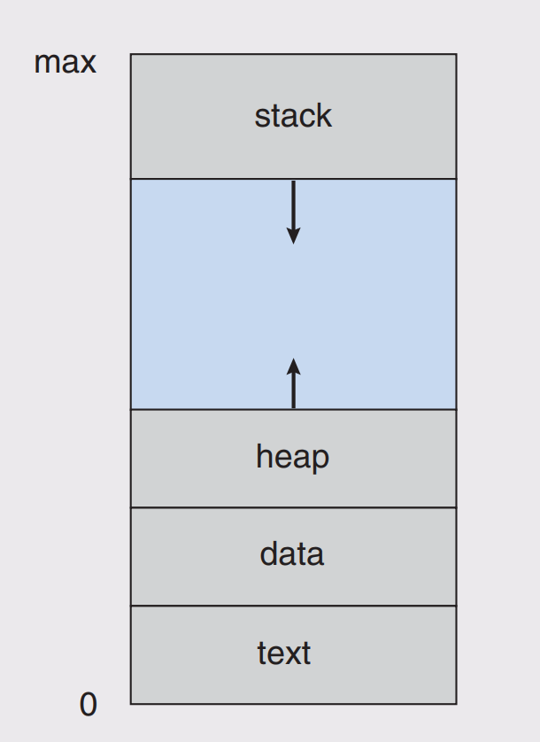
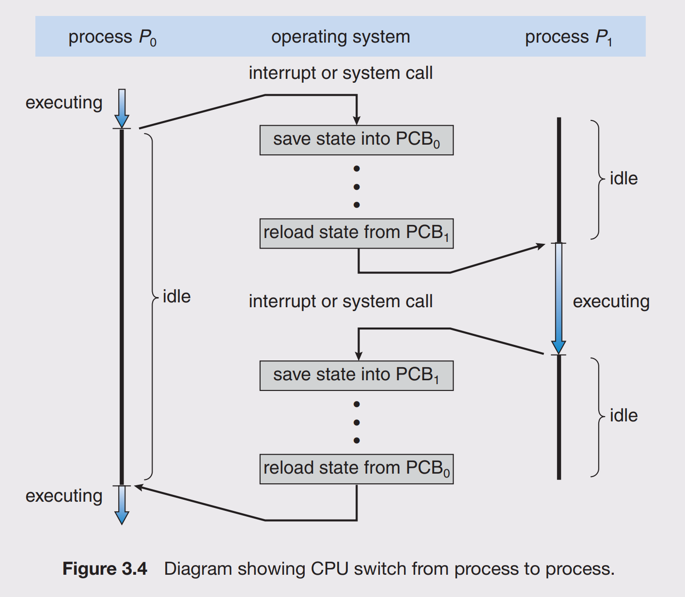

# Process

## Composition

- Text section: contains the program code
- Program counter: pointer to next instruction to be executed
- Stack: contains temporary data (such as function parameters, return address and local variables)
- Heap: contains dynamically allocated data
- Data: contains global variables

## State

- New: the process is being created
- Running: instructions are being executed
- Waiting: the process is waiting for some event to occur (such as an I/O completion or reception of a signal)
- Ready: the process is waiting to be assigned to a processor
- Terminated: the process has finished execution

## State Transition

| From | To | Description |
| ---- | -- | ----------- |
| Running | Waiting | When a running job requests I/O or makes system call, the job changes state from running to waiting |
| Running | Ready | When an I/O requests or system call completes, the running job changes state from running to ready
| Waiting | Ready | When an I/O requests or system call completes, the job waiting for the request to complete changes state from waiting to ready
| Ready | Running | When an I/O requests or ssytem call completes, one of the ready jobs are selected to run on the CPU and changes state from ready to running

## Process Control Block (PCB)

Each process is represented in OS by PCB. It contains:

- Process state: The state may be new, ready, running, waiting, halted, and so on
- Program counter: The counter indicates the address of the next instruction to be executed for this process
- CPU registers: The registers vary in number and type, depending on the computer architecture. They include accumulators, index registers, stack pointers, and general-purpose registers, plus any condition-code information. Along with the program counter, this state information must be saved when an interrupt occurs, to allow the process to be continued correctly afterward
- CPU-scheduling information: This information includes a process priority, pointers to scheduling queues, and any other scheduling parameters
- Memory-management information: This information may include such items as the value of the base and limit registers and the page tables, or the segment tables, depending on the memory system used by the operating system
- Accounting information: This information includes the amount of CPU and real time used, time limits, account numbers, job or process numbers, and so on
- I/O status information: This information includes the list of I/O devices allocated to the process, a list of open files, and so on

## Context Switch

- When interrupt occurs, the system needs to save the current context of the process running on the CPU so that it can restore that context when its processing is done, essentially suspending the process and then resuming it
- Context switch is performing a state save of the current process and a state restore of a different process
