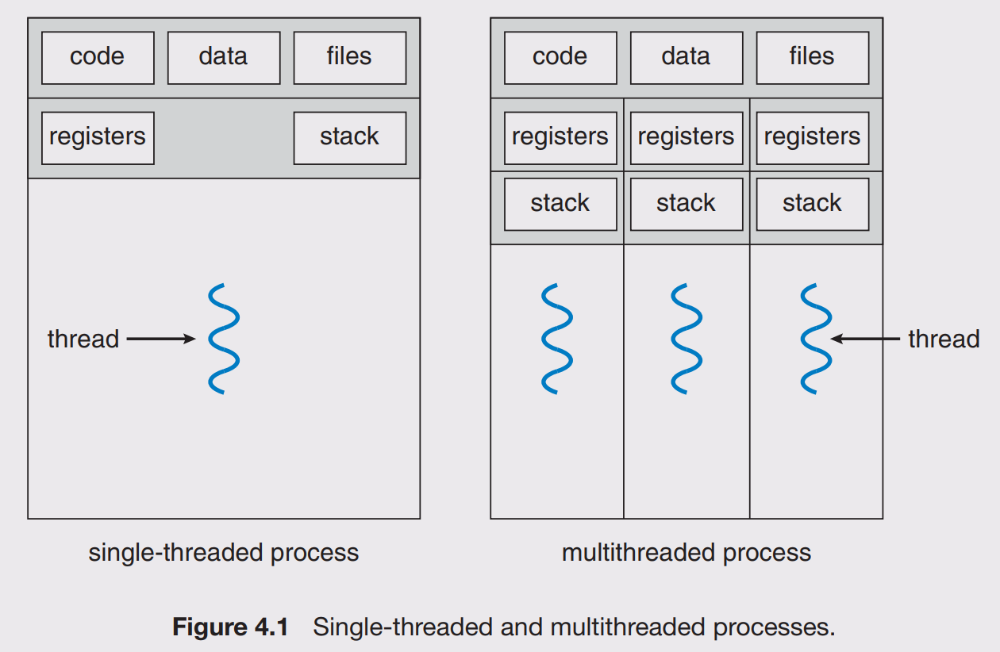

# Thread

## Kind of Thread

There are 3 kinds of thread:

- Hardware thread is a physical CPU or core. Typically, a 4 core CPU can genuinely support 4 hardware threads at once - the CPU really is doing 4 things at the same time. If a core has hyper-threading, there will be two hardware threads offered by single physical core.
- Kernel thread are implemented in kernel space and recognized by OS.
- User thread are implemented in user space and not recognized by OS.

## Composition

A thread has its own:

- Register set
- Program counter
- Stack

Threads of a process share:

- Text
- Heap
- Data

## Multithreading Models

- Many to One: N user threads are multiplexed to 1 kernel thread. This has the advantage of being very quick to context switch but cannot take advantage of multi-core systems.
- One to One: 1 user thread is multiplexed to 1 kernel thread. It takes advantage of all of the cores on the machine, but context switching is slow because it has to trap through the OS.
- Many to Many: N user threads are multiplexed to N kernel thread. You get quick context switches and you take advantage of all the cores in your system. The main disadvantage of this approach is the complexity it adds to the scheduler.

In Many to One model, when a user thread making an I/O request, all other threads are also blocked. The reason is that while waiting for I/O, kernel thread is in waiting state and not scheduled any CPU.

## Signal

A signal is a notification sent to a process in order to notify it of an event that occured. When the signal is sent, the OS interrupts the target process's normal flow of execution to deliver the signal. If the process has previously registered a signal handler, that routine is executed. Otherwise, the default signal handler is executed.

## Reference

- [Race Condition vs. Data Race](https://blog.regehr.org/archives/490)
- [What is a Race Condition?](https://www.baeldung.com/cs/race-conditions)
- [Race Conditions versus Data Races](https://www.modernescpp.com/index.php/race-condition-versus-data-race)
- [Are “data races” and “race condition” the same thing](https://stackoverflow.com/a/18049303)