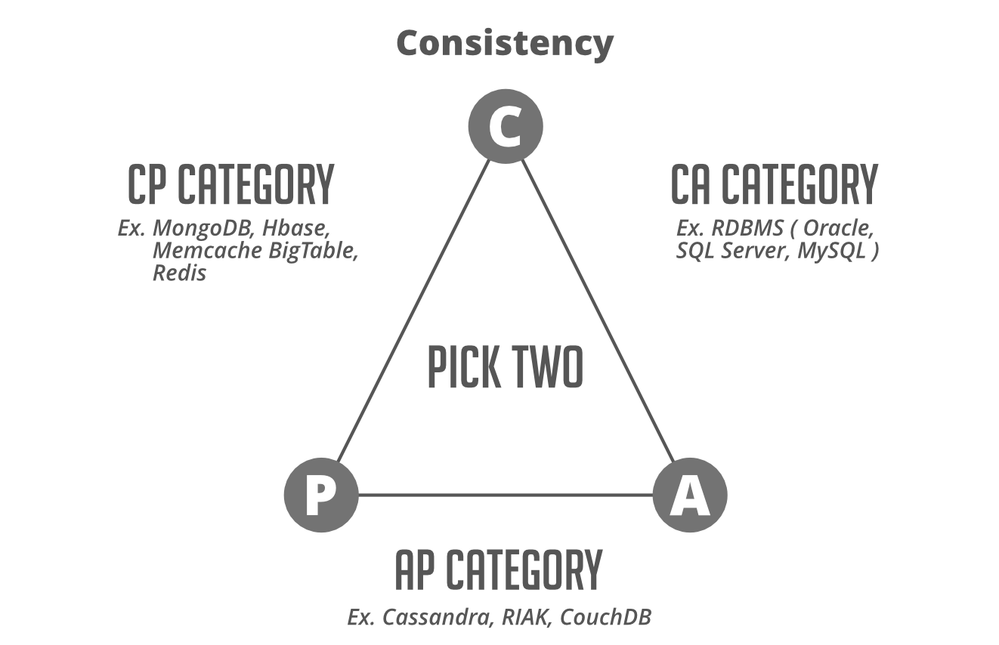

# How to Choose The Right Database for Your Application?
## Introduction
- Working with a database you’re already familiar with is perfectly fine if performance is not an important requirement for your system.
- But consider a situation when your application grows and after a couple of years your app starts facing some issues. It will become a headache for developers and administrators to fix the issue.
- It doesn't matter you are working on a project from scratch, or you’re already working on a mature project, it’s important to know the limitations of the database and identify when to add another type of DB in your project.
- There are more than 300 database management systems available in the market and choosing the one can be overwhelming for developers.
- A variety of options available in relational (MySQL, PostgreSQL, Oracle DB, etc) and non-relational (MongoDB, Apache HBase, Cassandra, etc.)
- You need to understand none of them fits on all kinds of projects requirement. Each one of them has some strengths and weaknesses.
## How do you make this decision when you’re architecting a given system?
- Ask a few important questions related to your project: 
  - How much data do you expect to store when the application is mature?
  - How many users do you expect to handle simultaneously at peak load?
  - What availability, scalability, latency, throughput, and data consistency does your application need?
  - How often will your database schemas change?
  - What is the geographic distribution of your user population?
  - What is the natural “shape” of your data?
  - Does your application need online transaction processing (OLTP), analytic queries (OLAP), or both?
  - What ratio of reads to writes do you expect in production?
  - What are your preferred programming languages?
  - Do you have a budget? If so, will it cover licenses and support contracts?
  - How strict are you with invalid data being sent to your database? (Ideally, you are very strict and do server-side data validation before persisting it to your database)
## Integration
- What system you need to integrate together?
- Make sure that your database management system can be integrated with other tools and services within your project.
- For example, if you have a big analytics job that’s currently running an Apache spark then probably you want to limit yourself to external databases that can connect easily to apache spark.
- Another example is ArangoDB which has excellent performance but libraries for this DBMS are still young and lack support. Using ArangoDB in combination with other tools may be risky, so the community suggests avoiding ArangoDB for complex projects.
## Scaling Requirement
- How much data are you really talking about? Is it really going to grow unbounded over time?
  - if so then you need some sort of database technology that is not limited to the data that you can store on one PC
  - You need to look at something like Cassandra or MongoDB or HBase where you can actually distribute the storage of your data across an entire cluster and scale horizontally instead of vertically.
- While choosing a database you also need to think about the transaction rate or throughput which means how many requests you intend to get per second.
  - Databases with high throughput can support many simultaneous users. If we are talking about thousands then again a single database service is not going to work out.
  - This is especially important when you are working on some big websites where we have a lot of web servers
  - You will have to choose a database that is distributed and allows you to spread out a load of those transactions more evenly.
  - In this case, NoSQL databases are a good choice instead of RDBMS.
## Support Consideration
- Sometimes you must think about the security of your system, so need to consider the security support of database
- The truth is most of the NoSQL database if you configure them with their default settings there will be no security at all
- So make sure you have someone available who knows what they’re doing for setting this up in a secure manner
- if you’re in a small organization you may have to choose the technology that offers professional paid support who can guide you through initial setup decisions in the initial administration of your server over time
## CAP Consideration
- CAP stands for Consistency, Availability, and Partition tolerance.
- The theorem states that you cannot achieve all the properties at the best level in a single database, as there are natural trade-offs between the items.
- You can only pick two out of three at a time and that totally depends on your priority based on your requirements
- Traditional relational databases are a natural fit for the CA side whereas Non-relational database engines mostly satisfy AP and CP requirements

- Consistency means that any read request will return the most recent write. Data consistency is usually “strong” for SQL databases and for NoSQL database consistency may be anything from “eventual” to “strong”.
- Availability means that a non-responding node must respond in a reasonable amount of time. Not every application needs to run 24/7 with 99.999% availability but most likely you will prefer  a database with higher availability.
- Partition tolerance means the system will continue to operate despite network or node failures.
- The type of application will determine what you want there and only you know the actual requirements 
  - Is it actually ok if your system goes down for a few seconds or a few minutes, if not then availability should be your prime concern? 
  - If you’re dealing with something with real transactional information like a stock transaction or financial transactions you might value consistency above all
## Schemas or Data Model
- Relational databases store data in a fixed and predefined structure. It means when you start development you will have to define your data schema in terms of tables and columns. You have to change the schema every time the requirements change.
- NoSQL database provides much more flexibility when it comes to handling data. There is no requirement to specify the schema to start working with the application. Also, the NoSQL database doesn’t put a restriction on the types of data you can store together. NoSQL databases have proven to be a much better choice in that regard especially for agile development which requires fast implementation. NoSQL databases have proven to be a much better choice in that regard especially for agile development which requires fast implementation.
## Ref 
- https://www.geeksforgeeks.org/how-to-choose-the-right-database-for-your-application/

 