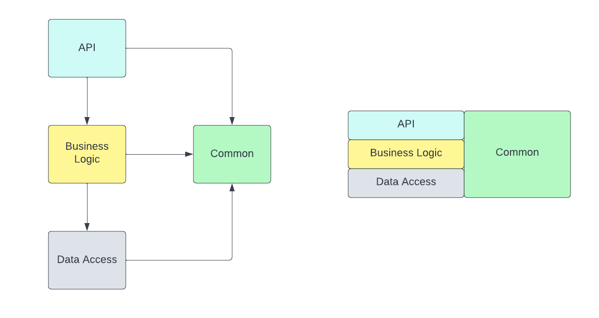
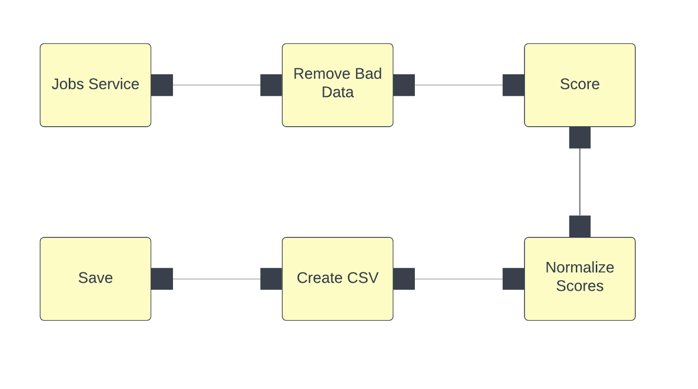
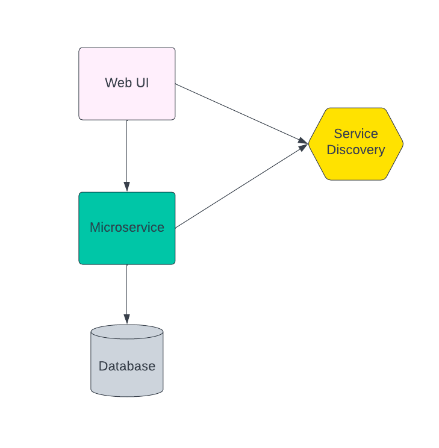
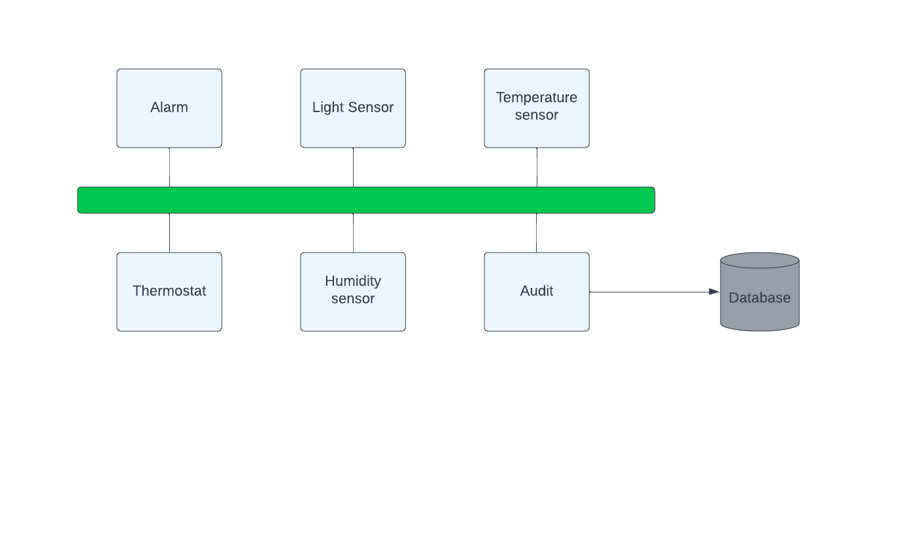
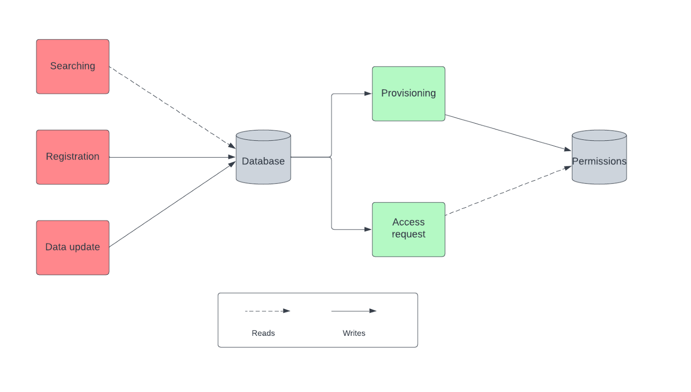

# Fundamental Software Architectural Patterns
- Patterns are essentially reusable solutions to common problems
- They define a solution for a variety of quality attributes and contemplate multiple components in a software system.
- The scope is broader for the architectural patterns while design patterns represent a way to structure classes to build the best internal structure.
## Layers Pattern
- Perhaps the most used (and abused) pattern which is the layered pattern.
- Partitioning a system into separate layers, organizing components within them by related criteria, allows developers and teams to work better together.
- The layers promote good practices of low coupling and high cohesion.
- Each module must be assigned to one and only one layer, where upper layers are allowed to use lower layers (one way only)
- It is a design that is justified in terms of maintainability, offering that different teams can collaborate on different modules in parallel
- Example:

## Client Server Pattern
- A central authority (Server) offers one or more services that are consumed by one or more consumers (Client).
- This model offers the possibility of building distributed systems where the server centralizes the resources and workload in one place so that later multiple consumers use this data independently.
- User applications consume the data and are responsible for providing an interface to interact with them, so the client and server often cooperate to achieve a common system
## Pipe and Filter Pattern
- With the pipe and filters pattern, each component named filter is responsible for a single transformation or operation on the data
- Data is streamed from one filter to the next as fast as possible and data operation occurs in parallel
- It is a widely used pattern in data analysis and data transformation use cases
- Example of this pattern is when we use the unix pipe function to combine commands

- Filter: it is the component that reads the data, transforms it and returns the transformed data
- Pipe: It is a connector that transports the data from one filter to the next and must ensure that the data is not modified along the way
- It is a pattern that can become computationally expensive due to its nature of data analysis.
- But it offers performance at a higher level of architecture due to the ability to post-process data, clean it, classify it, removing the workload from other more “real time” pieces.
## Service-Oriented-Architecture
- Independent components are implemented as services, which offer specific functionality.
- These services are combined at run time to define the behavior of the system as a whole
- Traditional SOA systems rely heavily on the SOAP protocol, which works by exchanging XML messages
- The more “modern” SOA applications encourage the use of microservices connected by lightweight messages on a protocol like HTTP
- This diagram shows two services attached to the service registry. The services should then check the registry to look up connection information for other services they want to call

- This architecture promotes the interoperability and scalability of a system
- It also entails the complexity of distributed systems for their definition and integration, since it is often difficult to control the modifications in the messages, which can affect the consumers of the different services
## Pub Sub Pattern
- Data producers and consumers exist independently and are anonymous to each other
- In general, multiple consumers subscribe to events published by multiple producers
- Both actors communicate indirectly through an event bus which is responsible for connecting content publishers with interested subscribers
- All communications in this pattern take place on the event bus so all components must be connected to it. The choice of technology for this bus is critical to its successful operation.

- This architecture promotes reusability and performance in the exchange of data due to the ease of access to them, optimizing how they are produced and consumed in the event bus.
- However, it is difficult to think about the performance of these systems given the asynchronous nature of communication.
- The event bus is the bottleneck in the good or bad performance of the system
## Shared Data Pattern
- Multiple components access a set of data through a common data store
- No component is entirely responsible for the data or its storage, rather it is a common medium for all consumers
- This pattern is particularly useful when multiple components require a large amount of data.

- Today the complexity of this architecture is facilitated, for example, by cloud services such as AWS RDS, which is responsible for provisioning a database with reading replicas, scalability and backups facilitating the management and provisioning of such characteristics
- This pattern promotes reliability through data consistency as well as scalability and performance if the data is partitioned correctly
- On the other hand, there is also a single point of failure in case the system is not managed correctly
## p2p Pattern
- Peer-to-peer architectural patterns belong to the category of symmetric client-server patterns
- Symmetric in this context refers to the fact that there is no need for a strict division in terms of client, server, and so on in the network of systems
- A single system acts as both client and server
- Each system, also called a peer, sends requests to other peers in the network and at the same time receives and services requests from other peers, which are part of the network
- Examples of this architecture in file-sharing networks
## Service Broker Pattern
- Three main components are involved in a broker system: the broker, the server, and the client
- This pattern is used to structure distributed systems with decoupled components
- It is, at a certain level, an extension of the Client-Server approach for more complex scenarios
- The broker is the message-routing component of your system. It passes messages from client to server and from server to client