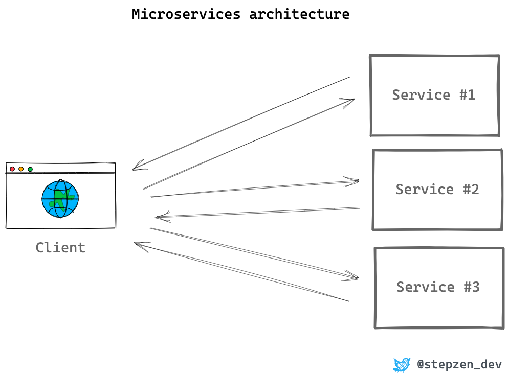
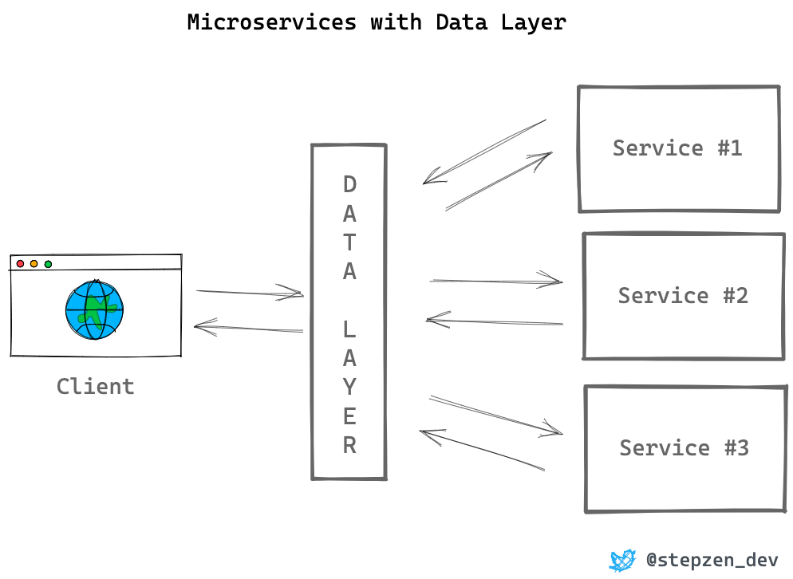
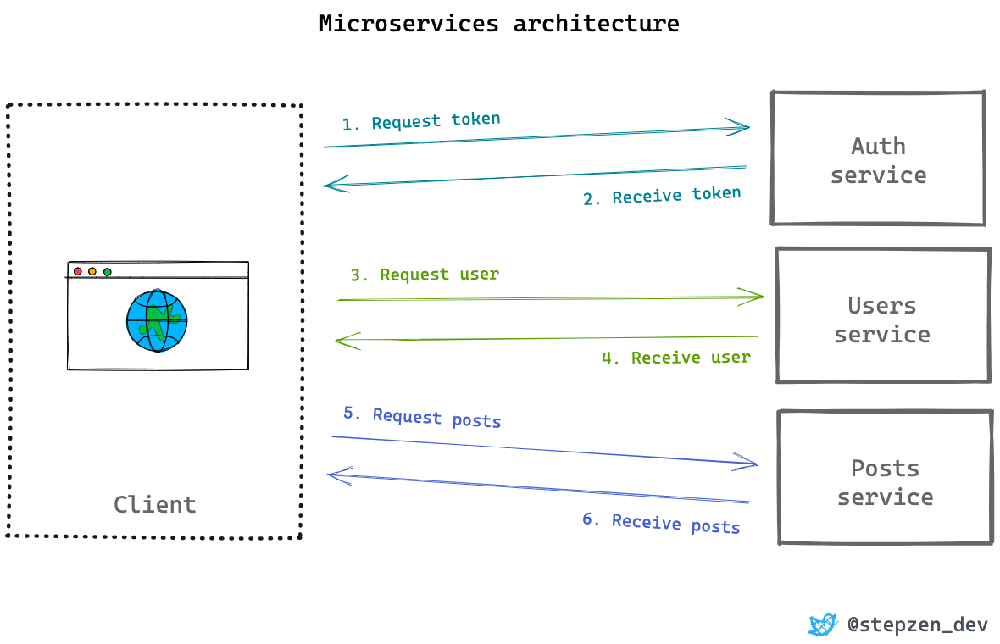

# GraphQL in microservices
## Why Microservices?
- Microservices are a perfect method to split your critical services into smaller services instead of one monolith APIs
- Microservices are supposed to be independent services that have no direct connection with each other
- Typically these services will all have their API, either REST or GraphQL, consumable from a client

- When using a data layer for your microservices, it serves as the single entry point for clients who consume your APIs
- Through the data layer all the clients' requests are processed and forwarded to the correct microservice
- Therefore, the client doesn't have to call all these microservices individually
- The approach of using a data layer as entry point for microservices is different from the BFF (Backend-For-Frontend) pattern, where other clients will interact with different endpoints

- Use a data layer for microservices let you:
  - Hide the microservice architecture from the client that interacts with it
  - By providing a single API it reduces the number of requests from your clients. Only the API of the data layer will be called
  - Simplifies the experience to consume your APIs
## GraphQL as Data Layer
- There is a whole range of services and solutions available to create a data layer for your microservices
- Most of these aren't made for GraphQL, while GraphQL is a great solution to build this API data layer
- GraphQL can be used in both a microservices architecture and when you have a monolith
- In your client, you want to authenticate a user and show all the posts of this user. The diagram below shows what requests you need to make from a client in a microservices' architecture without a data layer that services as a universal API

- You'll send and receive at least six network requests as microservices are not in direct contact with other microservices
- GraphQL can solve this problem for monolith APIs based on REST and for a microservice architecture when it's implemented as a data layer
- With GraphQL, you can construct a query to retrieve both the user and posts of that user in one request. The API data layer will send the correct requests to the microservices for users and posts and stitch the data into one response
- Lead to increased response time, but this cost is often insignificant
- A drawback of the data layer pattern is the increased complexity it brings with it. The data layer needs to be built, maintained, and deployed when the underlying microservices are updated. Building this can be very time-consuming for smaller teams
## Ref
- https://www.youtube.com/watch?v=8uUMegdI3ZM
- https://www.youtube.com/watch?v=eIQh02xuVw4
- https://stepzen.com/blog/why-graphql-is-perfect-as-data-layer-for-microservices