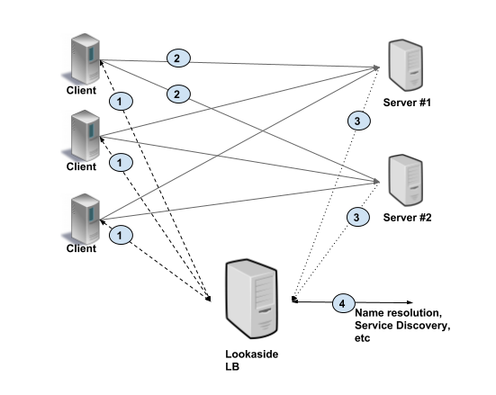

# GRPC Load balancing

## GRPC Load balancing Options

### Server-side (Proxy)

In Proxy load balancing, **<u>the client issues RPCs to the a Load Balancer (LB) proxy. The LB distributes the RPC call to one of the available backend servers</u>** that implement the actual logic for serving the call. The LB keeps track of load on each backend and implements algorithms for distributing load fairly. The clients themselves do not know about the backend servers. Clients can be untrusted. This architecture is typically used for user facing services where clients from open internet can connect to servers in a data center, as shown in the picture below. In this scenario, clients make requests to LB (#1). The LB passes on the request to one of the backends (#2), and the backends report load to LB (#3).

Below are some types of Server-side load balancing option.

#### Network (L3/L4) Load balancer

A network load balancer (NAB) operates at the layer-4 of OSI model. Therefore it is very fast and can handle much more connections. When a new TCP traffic connection comes in, the load balancer selects an instance and the connection is routed to that single instance for the life of the connection.

#### Application (L7) Load balancers (ALB)

In application load balancer (LAB), the LB terminates and parses the HTTP/2 protocol. The LB can inspect each request and assign a backend based on the request contents. For example, a session cookie sent as part of HTTP header can be used to associate with a specific backend, so all requests for that session are served by the same backend. Once the LB has chosen an appropriate backend, it creates a new HTTP/2 connection to that backend. It then forwards the HTTP/2 streams received from the client to the backend(s) of choice. With HTTP/2, LB can distribute the streams from one client among multiple backends.

#### L3/L4 (Transport) vs L7 (Application) 

#### Problem with Server-side GRPC Load balancing

gRPC connections are sticky. Meaning that when a connection is made from client to the server, the same connection will be reused for many requests (multiplexed) for as long as possible. This is done to avoid all the initial time and resources spent for tcp handshakes. So when a client grabs a connection to an instance of the server, it will hold on to it.

Now, when the same client starts sending large volumes of requests, they will all go to the same server instance. And that is exactly the problem, there will be no chance of distributing that load to the other instances. They all go to the same instance.

That is why a sticky connection, makes the load balancing very difficult.

##### ⚠️ Sticky connections and Auto Scaling

If load (memory or cpu) on a single server instance goes higher than the auto scaling policy, it will cause a new instance(s) to be spun up in that target group.

But a new instance in the target group is NOT going to be helpful. Why? Again, because gRPC connections are persistent and sticky. The client that was sending large volumes of requests, will keep sending them to them same server instance it has the connection to.

Therefore new server instances are spun up, but none of the requests overload is going to the new instance(s). Same single server instance with heavy usage is still receiving loads of requests from the client (as the client keeps reusing the same connection).

There is a chance that the auto scaling policy keeps triggering and adding new instances to the target group (as there is a single instance with overloaded cpu/memory). But these new instances receive close to zero traffic. The auto scaling policy could keep triggering and potentially maximizing the allowed instances in the target group, without actually benefiting from the requests being sent to the new instances.

##### How to distribute the load with gRPC sticky connections?

To have a chance of distributing the load basically we have to give up the stickiness and persistent connections with one of the following approaches:

1. Clients to reconnect periodically

If you have control over the connecting gRPC client, you can force the client to disconnect periodically and reconnect. This act will force the client to send a new request to the load balancer and as a response to this request this time a healthier instance will be returned. This technique forces the load to be balanced.

2. Server forcefully disconnects the clients periodically

If you do NOT have control over the connecting gRPC clients, you can implement similar logic on the server side. Making the server to forcefully shut down the connections after sometime, and when they reconnect, it automatically causes the new connections to go to the healthier instances.

> Either of these approaches defeats a fundamental gRPC benefit: reusable connections.

### Client-side

In Client side load balancing, the client is aware of multiple backend servers and chooses one to use for each RPC. The client gets load reports from backend servers and the client implements the load balancing algorithms. In simpler configurations server load is not considered and client can just round-robin between available servers. This is shown in the picture below. As you can see, the client makes request to a specific backend (#1). The backends respond with load information (#2), typically on the same connection on which client RPC is executed. The client then updates its internal state.

#### Thick client

A thick client approach means the load balancing smarts are implemented in the client. The client is responsible for keeping track of available servers, their workload, and the algorithms used for choosing servers. The client typically integrates libraries that communicate with other infrastructures such as service discovery, name resolution, quota management, etc.

The gRPC client supports an API that allows load balancing policies to be implemented and plugged into gRPC. An LB policy is responsible for:

- Receiving updated configuration and list of server addresses from the resolver
- Creating subchannels for the server addresses and managing their connectivity behavior
- Setting the overall connectivity state (usually computed by aggregating the connectivity states of its subchannels) of the channel
- For each RPC sent on the channel, determining which subchannel to send the RPC on

There are a number of LB policies provided with gRPC. The most notable ones are `pick_first` (the default), `round_robin`. There are also a number of additional LB policies to support xDS, although they are not currently configurable directly.

Below is how grpc load balancing work:

1. On startup, the gRPC client issues a name resolution request for the server name. The name will resolve to a list of IP addresses, a service config that indicates which client-side load-balancing policy to use (e.g., round_robin or grpclb) and provides a configuration for that policy, and a set of attributes (channel args in C-core).

2. The client instantiates the load balancing policy and passes it its configuration from the service config, the list of IP addresses, and the attributes.

3. The load balancing policy creates a set of subchannels (arrows that connect gRPC Client and gRPC Servers) for the IP addresses of the servers (which might be different from the IP addresses returned by the resolver; see below). It also watches the subchannels' connectivity states and decides when each subchannel should attempt to connect.

4. For each RPC sent, the load balancing policy decides which subchannel (i.e., which server) the RPC should be sent to.

There are many load balancing policy for a thick client as below.

##### pick_first (default)

This is the default LB policy if the service config does not specify any LB policy. It does not require any configuration.

The pick_first policy takes a list of addresses from the resolver. It attempts to connect to those addresses one at a time, in order, until it finds one that is reachable. If none of the addresses are reachable, it sets the channel's state to TRANSIENT_FAILURE while it attempts to reconnect. Appropriate backoff is applied for repeated connection attempts.

If it is able to connect to one of the addresses, it sets the channel's state to READY, and then **<u>all RPCs sent on the channel will be sent to that address</u>**. If the connection to that address is later broken, the pick_first policy will put the channel into state IDLE, and it will not attempt to reconnect until the application requests that it does so (either via the channel's connectivity state API or by sending an RPC).

##### round_robin

This LB policy is selected via the service config. It does not require any configuration.

This policy takes a list of addresses from the resolver. It creates a subchannel for each of those addresses and constantly monitors the connectivity state of the subchannels. Whenever a subchannel becomes disconnected, the `round_robin` policy will ask it to reconnect, with appropriate connection backoff.

The policy sets the channel's connectivity state by aggregating the states of the subchannels:

- If any one subchannel is in READY state, the channel's state is READY.
- Otherwise, if there is any subchannel in state CONNECTING, the channel's state is CONNECTING.
- Otherwise, if there is any subchannel in state IDLE, the channel's state is IDLE.
- Otherwise, if all subchannels are in state TRANSIENT_FAILURE, the channel's state is TRANSIENT_FAILURE.

Note that when a given subchannel reports TRANSIENT_FAILURE, it is considered to still be in TRANSIENT_FAILURE until it successfully reconnects and reports READY. In particular, we ignore the transition from TRANSIENT_FAILURE to CONNECTING.

When an RPC is sent on the channel, **<u>the `round_robin` policy will iterate over all subchannels that are currently in READY state, sending each successive RPC to the next successive subchannel in the list, wrapping around to the start of the list when needed</u>**.

#### Lookaside Load balancing

With lookaside load balancing, the load balancing smarts are implemented in a special LB server. The heavy lifting of keeping server state and implementation of LB algorithm is consolidated in the lookaside LB. The balancer updates the server list as needed to balance the load as well as handle server unavailability or health issues. The load balancer will make any necessary complex decisions and inform the client. The load balancer may communicate with the backend servers to collect load and health information.

The client relies on the load balancer to provide load balancing configuration and the list of server addresses to which the client should send requests. Note that client might choose to implement simple algorithms on top of the sophisticated ones implemented in the LB. 

The picture below illustrates this approach. The client gets at least one address from lookaside LB (#1). Then the client uses this address to make a RPC (#2), and server sends load report to the LB (#3). The lookaside LB communicates with other infrastructure such as name resolution, service discovery, and so on (#4).

gRPC defines a protocol for communication between client and LB using this model as below.

##### xDS

##### ~~grpclb~~ (deprecated)

## Recommendations and best practices 

Depending upon the particular deployment and constraints, we suggest the following.

## References

- [Load Balancing in gRPC](https://github.com/grpc/grpc/blob/master/doc/load-balancing.md)
- [Why load balancing gRPC is tricky?](https://majidfn.com/blog/grpc-load-balancing)
- [gRPC Load Balancing](https://grpc.io/blog/grpc-load-balancing/)
- [Pooling gRPC Connections](https://mycodesmells.com/post/pooling-grpc-connections)
- [gRPC xDS Feature](https://github.com/grpc/grpc/blob/master/doc/grpc_xds_features.md)