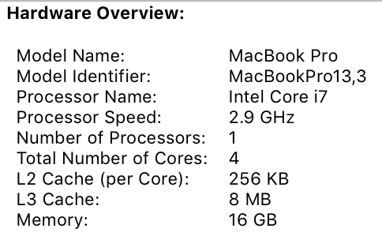
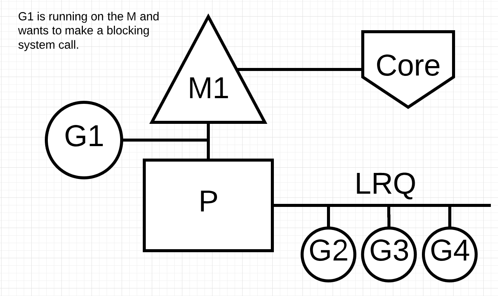
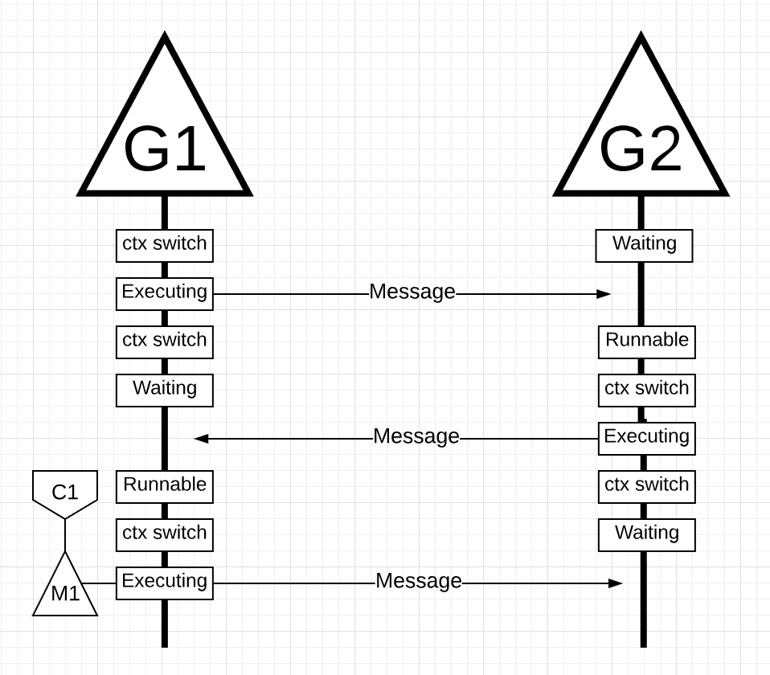

# Scheduling in Go

## Part II - Go Scheduler

### Introduction

In the [first part](https://www.ardanlabs.com/blog/2018/08/scheduling-in-go-part1.html) of this scheduling series, I explained aspects of the operating-system scheduler that I believe are important in understanding and appreciating the semantics of the Go scheduler. In this post, I will explain at a semantic level how the Go scheduler works and focus on the high-level behaviors. The Go scheduler is a complex system and the little mechanical details are not important. What’s important is having a good model for how things work and behave. This will allow you to make better engineering decisions.

### Your Program Starts

When your Go program starts up, it’s given a Logical Processor (P) for every virtual core that is identified on the host machine. If you have a processor with multiple hardware threads per physical core (Hyper-Threading), each hardware thread will be presented to your Go program as a virtual core. To better understand this, take a look at the system report for my MacBook Pro.



You can see I have a single processor with 4 physical cores. What this report is not exposing is the number of hardware threads I have per physical core. The Intel Core i7 processor has Hyper-Threading, which means there are 2 hardware threads per physical core. This will report to the Go program that 8 virtual cores are available for executing OS Threads in parallel.

To test this, consider the following program:

```go
package main

import (
	"fmt"
	"runtime"
)

func main() {
    // NumCPU returns the number of logical
    // CPUs usable by the current process.
    fmt.Println(runtime.NumCPU())
}
```

When I run this program on my local machine, the result of the NumCPU() function call will be the value of 8. Any Go program I run on my machine will be given 8 P’s.

Every P is assigned an OS Thread (“M”). The ‘M’ stands for machine. This Thread is still managed by the OS and the OS is still responsible for placing the Thread on a Core for execution, as explained in the last post. This means when I run a Go program on my machine, I have 8 threads available to execute my work, each individually attached to a P.

Every Go program is also given an initial Goroutine (“G”), which is the path of execution for a Go program. A Goroutine is essentially a Coroutine but this is Go, so we replace the letter “C” with a “G” and we get the word Goroutine. You can think of Goroutines as application-level threads and they are similar to OS Threads in many ways. Just as OS Threads are context-switched on and off a core, Goroutines are context-switched on and off an M.

The last piece of the puzzle is the run queues. There are two different run queues in the Go scheduler: the Global Run Queue (GRQ) and the Local Run Queue (LRQ). Each P is given a LRQ that manages the Goroutines assigned to be executed within the context of a P. These Goroutines take turns being context-switched on and off the M assigned to that P. The GRQ is for Goroutines that have not been assigned to a P yet. There is a process to move Goroutines from the GRQ to a LRQ that we will discuss later.

Figure 2 provides an image of all these components together.


### Cooperating Scheduler

As we discussed in the first post, the OS scheduler is a preemptive scheduler. Essentially that means you can’t predict what the scheduler is going to do at any given time. The kernel is making decisions and everything is non-deterministic. Applications that run on top of the OS have no control over what is happening inside the kernel with scheduling unless they leverage synchronization primitives like atomic instructions and mutex calls.

The Go scheduler is part of the Go runtime, and the Go runtime is built into your application. This means the Go scheduler runs in user space, above the kernel. The current implementation of the Go scheduler is not a preemptive scheduler but a cooperating scheduler. Being a cooperating scheduler means the scheduler needs well-defined user space events that happen at safe points in the code to make scheduling decisions.

What’s brilliant about the Go cooperating scheduler is that it looks and feels preemptive. You can’t predict what the Go scheduler is going to do. This is because decision making for this cooperating scheduler doesn’t rest in the hands of developers, but in the Go runtime. It’s important to think of the Go scheduler as a preemptive scheduler and since the scheduler is non-deterministic, this is not much of a stretch.

### Goroutine States

Just like Threads, Goroutines have the same three high-level states. These dictate the role the Go scheduler takes with any given Goroutine. A Goroutine can be in one of three states: Waiting, Runnable or Executing.

Waiting: This means the Goroutine is stopped and waiting for something in order to continue. This could be for reasons like waiting for the operating system (system calls) or synchronization calls (atomic and mutex operations). These types of latencies are a root cause for bad performance.

Runnable: This means the Goroutine wants time on an M so it can execute its assigned instructions. If you have a lot of Goroutines that want time, then Goroutines have to wait longer to get time. Also, the individual amount of time any given Goroutine gets is shortened as more Goroutines compete for time. This type of scheduling latency can also be a cause of bad performance.

Executing: This means the Goroutine has been placed on an M and is executing its instructions. The work related to the application is getting done. This is what everyone wants.

### Context Switching

The Go scheduler requires well-defined user-space events that occur at safe points in the code to context-switch from. These events and safe points manifest themselves within function calls. Function calls are critical to the health of the Go scheduler. Today (with Go 1.11 or less), if you run any tight loops that are not making function calls, you will cause latencies within the scheduler and garbage collection. It’s critically important that function calls happen within reasonable timeframes.

Note: There is a proposal for 1.12 that was accepted to apply non-cooperative preemption techniques inside the Go scheduler to allow for the preemption of tight loops.

There are four classes of events that occur in your Go programs that allow the scheduler to make scheduling decisions. This doesn’t mean it will always happen on one of these events. It means the scheduler gets the opportunity.

- The use of the keyword go
- Garbage collection
- System calls
- Synchronization and Orchestration

#### The use of the keyword go

The keyword `go` is how you create Goroutines. Once a new Goroutine is created, it gives the scheduler an opportunity to make a scheduling decision.

#### Garbage collection

Since the GC runs using its own set of Goroutines, those Goroutines need time on an M to run. This causes the GC to create a lot of scheduling chaos. However, the scheduler is very smart about what a Goroutine is doing and it will leverage that intelligence to make smart decisions. One smart decision is context-switching a Goroutine that wants to touch the heap with those that don’t touch the heap during GC. When GC is running, a lot of scheduling decisions are being made.

#### System calls

If a Goroutine makes a system call that will cause the Goroutine to block the M, sometimes the scheduler is capable of context-switching the Goroutine off the M and context-switch a new Goroutine onto that same M. However, sometimes a new M is required to keep executing Goroutines that are queued up in the P. How this works will be explained in more detail in the next section.

#### Synchronization and Orchestration

If an atomic, mutex, or channel operation call will cause the Goroutine to block, the scheduler can context-switch a new Goroutine to run. Once the Goroutine can run again, it can be re-queued and eventually context-switched back on an M.

### Asynchronous System Calls

When the OS you are running on has the ability to handle a system call asynchronously, something called the network poller can be used to process the system call more efficiently. This is accomplished by using kqueue (MacOS), epoll (Linux) or iocp (Windows) within these respective OS’s.

Networking-based system calls can be processed asynchronously by many of the OSs we use today. This is where the network poller gets its name, since its primary use is handling networking operations. By using the network poller for networking system calls, the scheduler can prevent Goroutines from blocking the M when those system calls are made. This helps to keep the M available to execute other Goroutines in the P’s LRQ without the need to create new Ms. This helps to reduce scheduling load on the OS.

The best way to see how this works is to run through an example.


Figure 3 shows our base scheduling diagram. Goroutine-1 is executing on the M and there are 3 more Goroutines waiting in the LRQ to get their time on the M. The network poller is idle with nothing to do.


In figure 4, Goroutine-1 wants to make a network system call, so Goroutine-1 is moved to the network poller and the asynchronous network system call is processed. Once Goroutine-1 is moved to the network poller, the M is now available to execute a different Goroutine from the LRQ. In this case, Goroutine-2 is context-switched on the M.


In figure 5, the asynchronous network system call is completed by the network poller and Goroutine-1 is moved back into the LRQ for the P. Once Goroutine-1 can be context-switched back on the M, the Go related code it’s responsible for can execute again. The big win here is that, to execute network system calls, no extra Ms are needed. The network poller has an OS Thread and it is handling an efficient event loop.

### Synchronous System Calls

What happens when the Goroutine wants to make a system call that can’t be done asynchronously? In this case, the network poller can’t be used and the Goroutine making the system call is going to block the M. This is unfortunate but there’s no way to prevent this from happening. One example of a system call that can’t be made asynchronously is file-based system calls. If you are using CGO, there may be other situations where calling C functions will block the M as well.

*Note: The Windows OS does have the capability of making file-based system calls asynchronously. Technically when running on Windows, the network poller can be used.*

Let’s walk through what happens with a synchronous system call (like file I/O) that will cause the M to block.



Figure 6 is showing our basic scheduling diagram again but this time Goroutine-1 is going to make a synchronous system call that will block M1.


In figure 7, the scheduler is able to identify that Goroutine-1 has caused the M1 to block. *Remember that, when a thread blocks, it has no chance to use CPU and immediately transition to waiting state*. At this point, the scheduler detaches M1 from the P with the blocking Goroutine-1 still attached. Then the scheduler brings in a new M2 to service the P. At that point, Goroutine-2 can be selected from the LRQ and context-switched on M2. If an M already exists because of a previous swap, this transition is quicker than having to create a new M.


In figure 8, the blocking system call that was made by Goroutine-1 finishes. At this point, Goroutine-1 can move back into the LRQ and be serviced by the P again. M1 is then placed on the side for future use if this scenario needs to happen again.

### Work Stealing

Another aspect of the scheduler is that it’s a work-stealing scheduler. This helps in a few areas to keep scheduling efficient. For one, the last thing you want is an M to move into a waiting state because, once that happens, the OS will context-switch the M off the Core. This means the P can’t get any work done, even if there is a Goroutine in a runnable state, until an M is context-switched back on a Core. The work stealing also helps to balance the Goroutines across all the P’s so the work is better distributed and getting done more efficiently.

Let’s run through an example.


In figure 9, we have a multi-threaded Go program with two P’s servicing four Goroutines each and a single Goroutine in the GRQ. What happens if one of the P’s services all of its Goroutines quickly?


In figure 10, P1 has no more Goroutines to execute. But theregg are Goroutines in a runnable state, both in the LRQ for P2 and in the GRQ. This is a moment where P1 needs to steal work. The rules for stealing work are as follows.

```go
package runtime

func schedule() {
    // only 1/61 of the time, check the GRQ
    // if there is any G append them to LRQ
    // if there is no such G check the LRQ 
    // if there is go such G in LRQ,
    //     try to steal Gs from other Ps' LRQ
    //     if there is no such G, check the GRQ 
    //     if there is no such G, poll network
}
```

So based on these rules in Listing 2, P1 needs to check P2 for Goroutines in its LRQ and take half of what it finds.


So based on these rules in Listing 2, P1 needs to check P2 for Goroutines in its LRQ and take half of what it finds.

What happens if P2 finishes servicing all of its Goroutines and P1 has nothing left in its LRQ?


In figure 12, P2 finished all its work and now needs to steal some. First, it will look at the LRQ of P1 but it won’t find any Goroutines. Next, it will look at the GRQ. There it will find Goroutine-9.


In figure 13, P2 steals Goroutine-9 from the GRQ and begins to execute the work. What is great about all this work stealing is that it allows the Ms to stay busy and not go idle. This work stealing is considered internally as spinning the M. This spinning has other benefits that JBD explains well in her work-stealing blog post.

### Practical Example

With the mechanics and semantics in place, I want to show you how all of this comes together to allow the Go scheduler to execute more work over time. Imagine a multi-threaded application written in C where the program is managing two OS Threads that are passing messages back and forth to each other.


In figure 14, there are 2 Threads that are passing a message back and forth. Thread 1 gets context-switched on Core 1 and is now executing, which allows Thread 1 to send its message to Thread 2.

*Note: How the message is being passed is unimportant. What’s important is the state of the Threads as this orchestration proceeds.*


In figure 15, once Thread 1 finishes sending the message, it now needs to wait for the response. This will cause Thread 1 to be context-switched off Core 1 and moved into a waiting state. Once Thread 2 is notified about the message, it moves into a runnable state. Now the OS can perform a context switch and get Thread 2 executing on a Core, which it happens to be Core 2. Next, Thread 2 processes the message and sends a new message back to Thread 1.


In figure 16, Threads context-switch once again as the message by Thread 2 is received by Thread 1. Now Thread 2 context-switches from an executing state to a waiting state and Thread 1 context-switches from a waiting state to a runnable state and finally back to an executing state, which allows it to process and send a new message back.

All these context switches and state changes require time to be performed which limits how fast the work can get done. With each context-switching potential incurring a latency of ~1000 nanoseconds, and hopefully the hardware executing 12 instructions per nanosecond, you are looking at 12k instructions, more or less, not executing during these context switches. Since these Threads are also bouncing between different Cores, the chances of incurring additional latency due to cache-line misses are also high.

Let’s take this same example but use Goroutines and the Go scheduler instead.


In figure 17, there are two Goroutines that are in orchestration with each other passing a message back and forth. G1 gets context-switched on M1, which happens to be running on Core 1, which allows G1 to be executing its work. The work is for G1 to send its message to G2.


In figure 18, once G1 finishes sending the message, it now needs to wait for the response. This will cause G1 to be context-switched off M1 and moved into a waiting state. Once G2 is notified about the message, it moves into a runnable state. Now the Go scheduler can perform a context switch and get G2 executing on M1, which is still running on Core 1. Next, G2 processes the message and sends a new message back to G1.



In figure 19, things context-switch once again as the message sent by G2 is received by G1. Now G2 context-switches from an executing state to a waiting state and G1 context-switches from a waiting state to a runnable state and finally back to an executing state, which allows it to process and send a new message back.

Things on the surface don’t appear to be any different. All the same context switches and state changes are occuring whether you use Threads or Goroutines. However, there is a major difference between using Threads and Goroutines that might not be obvious at first glance.

In the case of using Goroutines, the same OS Thread and Core is being used for all the processing. This means that, from the OS’s perspective, the OS Thread never moves into a waiting state; not once. As a result all those instructions we lost to context switches when using Threads are not lost when using Goroutines.

Essentially, Go has turned IO/Blocking work into CPU-bound work at the OS level. Since all the context switching is happening at the application level, we don’t lose the same ~12k instructions (on average) per context switch that we were losing when using Threads. In Go, those same context switches are costing you ~200 nanoseconds or ~2.4k instructions. The scheduler is also helping with gains on cache-line efficiencies and NUMA. This is why we don’t need more Threads than we have virtual cores. In Go, it’s possible to get more work done, over time, because the Go scheduler attempts to use less Threads and do more on each Thread, which helps to reduce load on the OS and the hardware.

### Conclusion

The Go scheduler is really amazing in how the design takes into account the intricacies of how the OS and the hardware work. The ability to turn IO/Blocking work into CPU-bound work at the OS level is where we get a big win in leveraging more CPU capacity over time. This is why you don’t need more OS Threads than you have virtual cores. You can reasonably expect to get all of your work done (CPU and IO/Blocking bound) with just one OS Thread per virtual core. Doing so is possible for networking apps and other apps that don’t need system calls that block OS Threads.

As a developer, you still need to understand what your app is doing in terms of the kinds of work you are processing. You can’t create an unlimited number of Goroutines and expect amazing performance. Less is always more, but with the understanding of these Go-scheduler semantics, you can make better engineering decisions. In the next post, I will explore this idea of leveraging concurrency in conservative ways to gain better performance while still balancing the amount of complexity you may need to add to the code.

## Part III - Concurrency

### Introduction

When I’m solving a problem, especially if it’s a new problem, I don’t initially think about whether concurrency is a good fit or not. I look for a sequential solution first and make sure that it’s working. Then after readability and technical reviews, I will begin to ask the question if concurrency is reasonable and practical. Sometimes it’s obvious that concurrency is a good fit and other times it’s not so clear.

In the first part of this series, I explained the mechanics and semantics of the OS scheduler that I believe are important if you plan on writing multithreaded code. In the second part, I explained the semantics of the Go scheduler that I believe are important for understanding how to write concurrent code in Go. In this post, I will begin to bring the mechanics and semantics of the OS and Go schedulers together to provide a deeper understanding on what concurrency is and isn’t.

The goals of this post are:

- Provide guidance on the semantics you must consider to determine if a workload is suitable for using concurrency.
- Show you how different types of workloads change the semantics and therefore the engineering decisions you will want to make.

### What is Concurrency

Concurrency means “out of order” execution. Taking a set of instructions that would otherwise be executed in sequence and finding a way to execute them out of order and still produce the same result. For the problem in front of you, it has to be obvious that out of order execution would add value. When I say value, I mean add enough of a performance gain for the complexity cost. Depending on your problem, out of order execution may not be possible or even make sense.

It’s also important to understand that [concurrency is not the same as parallelism](https://blog.golang.org/waza-talk). Parallelism means executing two or more instructions at the same time. This is a different concept from concurrency. Parallelism is only possible when you have at least 2 operating system (OS) and hardware threads available to you and you have at least 2 Goroutines, each executing instructions independently on each OS/hardware thread.


In figure 1, you see a diagram of two logical processors (P) each with their independent OS thread (M) attached to an independent hardware thread (Core) on the machine. You can see two Goroutines (G1 and G2) are executing in parallel, executing their instructions on their respective OS/hardware thread at the same time. Within each logical processor, three Goroutines are taking turns sharing their respective OS thread. All these Goroutines are running concurrently, executing their instructions in no particular order and sharing time on the OS thread.

Here’s the rub, sometimes leveraging concurrency without parallelism can actually slow down your throughput. What’s also interesting is, sometimes leveraging concurrency with parallelism doesn’t give you a bigger performance gain than you might otherwise think you can achieve.

### Workloads

How do you know when out of order execution may be possible or make sense? Understanding the type of workload your problem is handling is a great place to start. There are two types of workloads that are important to understand when thinking about concurrency.

- **CPU-Bound**: This is a workload that never creates a situation where Goroutines naturally move in and out of waiting states. This is work that is constantly making calculations. A Thread calculating Pi to the Nth digit would be CPU-Bound.

- **IO-Bound**: This is a workload that causes Goroutines to naturally enter into waiting states. This is work that consists in requesting access to a resource over the network, or making system calls into the operating system, or waiting for an event to occur. A Goroutine that needs to read a file would be IO-Bound. I would include synchronization events (mutexes, atomic), that cause the Goroutine to wait as part of this category.

With CPU-Bound workloads you need parallelism to leverage concurrency. A single OS/hardware thread handling multiple Goroutines is not efficient since the Goroutines are not moving in and out of waiting states as part of their workload. Having more Goroutines than there are OS/hardware threads can slow down workload execution because of the latency cost (the time it takes) of moving Goroutines on and off the OS thread. The context switch is creating a “Stop The World” event for your workload since none of your workload is being executed during the switch when it otherwise could be.

With IO-Bound workloads you don’t need parallelism to use concurrency. A single OS/hardware thread can handle multiple Goroutines with efficiency since the Goroutines are naturally moving in and out of waiting states as part of their workload. Having more Goroutines than there are OS/hardware threads can speed up workload execution because the latency cost of moving Goroutines on and off the OS thread is not creating a “Stop The World” event. Your workload is naturally stopped and this allows a different Goroutine to leverage the same OS/hardware thread efficiently instead of letting the OS/hardware thread sit idle.

How do you know how many Goroutines per hardware thread provides the best throughput? Too few Goroutines and you have more idle time. Too many Goroutines and you have more context switch latency time. This is something for you to think about but beyond the scope of this particular post.

For now it’s important to review some code to solidify your ability to identify when a workload can leverage concurrency, when it can’t and if parallelism is needed or not.

### Adding Numbers

We don’t need complex code to visualize and understand these semantics. Look at the following function named add that sums a collection of integers.

Listing 1. <https://play.golang.org/p/r9LdqUsEzEz>

```go
func add(numbers []int) int {
	var v int
	for _, n := range numbers {
		v += n
	}
	return v
}
```

In listing 1 on line 36, a function named add is declared that takes a collection of integers and returns the sum of the collection. It starts on line 37 with the declaration of the v variable to contain the sum. Then on line 38, the function traverses the collection linearly and each number is added to the current sum on line 39. Finally on line 41, the function returns the final sum back to the caller.

Question: is the add function a workload that is suitable for out of order execution? I believe the answer is yes. The collection of integers could be broken up into smaller lists and those lists could be processed concurrently. Once all the smaller lists are summed, the set of sums could be added together to produce the same answer as the sequential version.

However, there is another question that comes to mind. How many smaller lists should be created and processed independently to get the best throughput? To answer this question you must know what kind of workload add is performing. The add function is performing a CPU-Bound workload because the algorithm is performing pure math and nothing it does would cause the goroutine to enter into a natural waiting state. This means using one Goroutine per OS/hardware thread is all that is needed for good throughput.

Listing 2 below is my concurrent version of add.

*Note: There are several ways and options you can take when writing a concurrent version of add. Don’t get hung up on my particular implementation at this time. If you have a more readable version that performs the same or better I would love for you to share it.*

Listing 2. <https://play.golang.org/p/r9LdqUsEzEz>

```go
func addConcurrent(goroutines int, numbers []int) int {
	var v int64
	totalNumbers := len(numbers)
	lastGoroutine := goroutines - 1
	stride := totalNumbers / goroutines

	var wg sync.WaitGroup
	wg.Add(goroutines)

	for g := 0; g < goroutines; g++ {
		go func(g int) {
			start := g * stride
			end := start + stride
			if g == lastGoroutine {
				end = totalNumbers
			}

			var lv int
			for _, n := range numbers[start:end] {
				lv += n
			}

			atomic.AddInt64(&v, int64(lv))
			wg.Done()
		}(g)
	}

	wg.Wait()

	return int(v)
}
```

In Listing 2, the addConcurrent function is presented which is the concurrent version of the add function. The concurrent version uses 26 lines of code as opposed to the 5 lines of code for the non-concurrent version. There is a lot of code so I will only highlight the important lines to understand.

Line 48: Each Goroutine will get their own unique but smaller list of numbers to add. The size of the list is calculated by taking the size of the collection and dividing it by the number of Goroutines.

Line 53: The pool of Goroutines are created to perform the adding work.

Line 57-59: The last Goroutine will add the remaining list of numbers which may be greater than the other Goroutines.

Line 66: The sum of the smaller lists are summed together into a final sum.

The concurrent version is definitely more complex than the sequential version but is the complexity worth it? The best way to answer that question is to create a benchmark. For these benchmarks I have used a collection of 10 million numbers with the garbage collector turned off. There is a sequential version that uses the add function and a concurrent version that uses the addConcurrent function.

Listing 3.

```go
func BenchmarkSequential(b *testing.B) {
    for i := 0; i < b.N; i++ {
        add(numbers)
    }
}

func BenchmarkConcurrent(b *testing.B) {
    for i := 0; i < b.N; i++ {
        addConcurrent(runtime.NumCPU(), numbers)
    }
}
```

Listing 3 shows the benchmark functions. Here are the results when only a single OS/hardware thread is available for all Goroutines. The sequential version is using 1 Goroutine and the concurrent version is using runtime.NumCPU or 8 Goroutines on my machine. In this case, the concurrent version is leveraging concurrency without parallelism.

Listing 4.

```bash
10 Million Numbers using 8 goroutines with 1 core
2.9 GHz Intel 4 Core i7
Concurrency WITHOUT Parallelism
-----------------------------------------------------------------------------
$ GOGC=off go test -cpu 1 -run none -bench . -benchtime 3s
goos: darwin
goarch: amd64
pkg: github.com/ardanlabs/gotraining/topics/go/testing/benchmarks/cpu-bound
BenchmarkSequential      	    1000	   5720764 ns/op : ~10% Faster
BenchmarkConcurrent      	    1000	   6387344 ns/op
BenchmarkSequentialAgain 	    1000	   5614666 ns/op : ~13% Faster
BenchmarkConcurrentAgain 	    1000	   6482612 ns/op
```

Note: Running a benchmark on your local machine is complicated. There are so many factors that can cause your benchmarks to be inaccurate. Make sure your machine is as idle as possible and run benchmarks a few times. You want to make sure you see consistency in the results. Having the benchmark run twice by the testing tool is giving this benchmark the most consistent results.

Listing 5.

```go
10 Million Numbers using 8 goroutines with 8 cores
2.9 GHz Intel 4 Core i7
Concurrency WITH Parallelism
-----------------------------------------------------------------------------
$ GOGC=off go test -cpu 8 -run none -bench . -benchtime 3s
goos: darwin
goarch: amd64
pkg: github.com/ardanlabs/gotraining/topics/go/testing/benchmarks/cpu-bound
BenchmarkSequential-8        	    1000	   5910799 ns/op
BenchmarkConcurrent-8        	    2000	   3362643 ns/op : ~43% Faster
BenchmarkSequentialAgain-8   	    1000	   5933444 ns/op
BenchmarkConcurrentAgain-8   	    2000	   3477253 ns/op : ~41% Faster
```

The benchmark in listing 5 shows that the concurrent version is approximately 41 to 43 percent faster than the sequential version when an individual OS/hardware thread is available for each Goroutine. This is what I would have expected since all the Goroutines are now running in parallel, eight Goroutines executing their concurrent work at the same time.

### Sorting

It’s important to understand that not all CPU-bound workloads are suitable for concurrency. This is primarily true when it’s very expensive to either break work up, and/or combine all the results. An example of this can be seen with the sorting algorithm called Bubble sort. Look at the following code that implements Bubble sort in Go.

Listing 6. <https://play.golang.org/p/S0Us1wYBqG6>

```go
01 package main
02
03 import "fmt"
04
05 func bubbleSort(numbers []int) {
06     n := len(numbers)
07     for i := 0; i < n; i++ {
08         if !sweep(numbers, i) {
09             return
10         }
11     }
12 }
13
14 func sweep(numbers []int, currentPass int) bool {
15     var idx int
16     idxNext := idx + 1
17     n := len(numbers)
18     var swap bool
19
20     for idxNext < (n - currentPass) {
21         a := numbers[idx]
22         b := numbers[idxNext]
23         if a > b {
24             numbers[idx] = b
25             numbers[idxNext] = a
26             swap = true
27         }
28         idx++
29         idxNext = idx + 1
30     }
31     return swap
32 }
33
34 func main() {
35     org := []int{1, 3, 2, 4, 8, 6, 7, 2, 3, 0}
36     fmt.Println(org)
37
38     bubbleSort(org)
39     fmt.Println(org)
40 }
```

In listing 6, there is an example of Bubble sort written in Go. This sorting algorithm sweeps through a collection of integers swapping values on every pass. Depending on the ordering of the list, it may require multiple passes through the collection before everything is sorted.

Question: is the bubbleSort function a workload that is suitable for out of order execution? I believe the answer is no. The collection of integers could be broken up into smaller lists and those lists could be sorted concurrently. However, after all the concurrent work is done there is no efficient way to sort the smaller lists together. Here is an example of a concurrent version of Bubble sort.

Listing 8.

```go
01 func bubbleSortConcurrent(goroutines int, numbers []int) {
02     totalNumbers := len(numbers)
03     lastGoroutine := goroutines - 1
04     stride := totalNumbers / goroutines
05
06     var wg sync.WaitGroup
07     wg.Add(goroutines)
08
09     for g := 0; g < goroutines; g++ {
10         go func(g int) {
11             start := g * stride
12             end := start + stride
13             if g == lastGoroutine {
14                 end = totalNumbers
15             }
16
17             bubbleSort(numbers[start:end])
18             wg.Done()
19         }(g)
20     }
21
22     wg.Wait()
23
24     // Ugh, we have to sort the entire list again.
25     bubbleSort(numbers)
26 }
```

In Listing 8, the bubbleSortConcurrent function is presented which is a concurrent version of the bubbleSort function. It uses multiple Goroutines to sort portions of the list concurrently. However, what you are left with is a list of sorted values in chunks. Given a list of 36 numbers, split in groups of 12, this would be the resulting list if the entire list is not sorted once more on line 25.

Listing 9.

```bash
Before:
  25 51 15 57 87 10 10 85 90 32 98 53
  91 82 84 97 67 37 71 94 26  2 81 79
  66 70 93 86 19 81 52 75 85 10 87 49

After:
  10 10 15 25 32 51 53 57 85 87 90 98
   2 26 37 67 71 79 81 82 84 91 94 97
  10 19 49 52 66 70 75 81 85 86 87 93
```

Since the nature of Bubble sort is to sweep through the list, the call to bubbleSort on line 25 will negate any potential gains from using concurrency. With Bubble sort, there is no performance gain by using concurrency.

### Reading Files

Two CPU-Bound workloads have been presented, but what about an IO-Bound workload? Are the semantics different when Goroutines are naturally moving in and out of waiting states? Look at an IO-Bound workload that reads files and performs a text search.

This first version is a sequential version of a function called find.

Listing 10. <https://play.golang.org/p/8gFe5F8zweN>

```go
42 func find(topic string, docs []string) int {
43     var found int
44     for _, doc := range docs {
45         items, err := read(doc)
46         if err != nil {
47             continue
48         }
49         for _, item := range items {
50             if strings.Contains(item.Description, topic) {
51                 found++
52             }
53         }
54     }
55     return found
56 }
```

In listing 10, you see the sequential version of the find function. On line 43, a variable named found is declared to maintain a count for the number of times the specified topic is found inside a given document. Then on line 44, the documents are iterated over and each document is read on line 45 using the read function. Finally on line 49-53, the Contains function from the strings package is used to check if the topic can be found inside the collection of items read from the document. If the topic is found, the found variable is incremented by one.

Here is the implementation of the read function that is being called by find.

Listing 11. <https://play.golang.org/p/8gFe5F8zweN>

```go
33 func read(doc string) ([]item, error) {
34     time.Sleep(time.Millisecond) // Simulate blocking disk read.
35     var d document
36     if err := xml.Unmarshal([]byte(file), &d); err != nil {
37         return nil, err
38     }
39     return d.Channel.Items, nil
40 }
```

The read function in listing 11 starts with a time.Sleep call for one millisecond. This call is being used to mock the latency that could be produced if we performed an actual system call to read the document from disk. The consistency of this latency is important for accurately measuring the performance of the sequential version of find against the concurrent version. Then on lines 35-39, the mock xml document stored in the global variable file is unmarshaled into a struct value for processing. Finally, a collection of items is returned back to the caller on line 39.

With the sequential version in place, here is the concurrent version.

Note: There are several ways and options you can take when writing a concurrent version of find. Don’t get hung up on my particular implementation at this time. If you have a more readable version that performs the same or better I would love for you to share it.

Listing 12. <https://play.golang.org/p/8gFe5F8zweN>

```go
58 func findConcurrent(goroutines int, topic string, docs []string) int {
59     var found int64
60
61     ch := make(chan string, len(docs))
62     for _, doc := range docs {
63         ch <- doc
64     }
65     close(ch)
66
67     var wg sync.WaitGroup
68     wg.Add(goroutines)
69
70     for g := 0; g < goroutines; g++ {
71         go func() {
72             var lFound int64
73             for doc := range ch {
74                 items, err := read(doc)
75                 if err != nil {
76                     continue
77                 }
78                 for _, item := range items {
79                     if strings.Contains(item.Description, topic) {
80                         lFound++
81                     }
82                 }
83             }
84             atomic.AddInt64(&found, lFound)
85             wg.Done()
86         }()
87     }
88
89     wg.Wait()
90
91     return int(found)
92 }
```

In Listing 12, the findConcurrent function is presented which is the concurrent version of the find function. The concurrent version uses 30 lines of code as opposed to the 13 lines of code for the non-concurrent version. My goal in implementing the concurrent version was to control the number of Goroutines that are used to process the unknown number of documents. A pooling pattern where a channel is used to feed the pool of Goroutines was my choice.

There is a lot of code so I will only highlight the important lines to understand.

Lines 61-64: A channel is created and populated with all the documents to process.

Line 65: The channel is closed so the pool of Goroutines naturally terminate when all the documents are processed.

Line 70: The pool of Goroutines is created.

Line 73-83: Each Goroutine in the pool receives a document from the channel, reads the document into memory and checks the contents for the topic. When there is a match, the local found variable is incremented.

Line 84: The sum of the individual Goroutine counts are summed together into a final count.

The concurrent version is definitely more complex than the sequential version but is the complexity worth it? The best way to answer this question again is to create a benchmark. For these benchmarks I have used a collection of 1 thousand doc```uments with the garbage collector turned off. There is a sequential version that uses the find function and a concurrent version that uses the findConcurrent function.

Listing 13.

```go
func BenchmarkSequential(b *testing.B) {
    for i := 0; i < b.N; i++ {
        find("test", docs)
    }
}

func BenchmarkConcurrent(b *testing.B) {
    for i := 0; i < b.N; i++ {
        findConcurrent(runtime.NumCPU(), "test", docs)
    }
}
```

Listing 13 shows the benchmark functions. Here are the results when only a single OS/hardware thread is available for all Goroutines. The sequential is using 1 Goroutine and the concurrent version is using runtime.NumCPU or 8 Goroutines on my machine. In this case, the concurrent version is leveraging concurrency without parallelism.

Listing 14.

```bash
10 Thousand Documents using 8 goroutines with 1 core
2.9 GHz Intel 4 Core i7
Concurrency WITHOUT Parallelism
-----------------------------------------------------------------------------
$ GOGC=off go test -cpu 1 -run none -bench . -benchtime 3s
goos: darwin
goarch: amd64
pkg: github.com/ardanlabs/gotraining/topics/go/testing/benchmarks/io-bound
BenchmarkSequential      	       3	1483458120 ns/op
BenchmarkConcurrent      	      20	 188941855 ns/op : ~87% Faster
BenchmarkSequentialAgain 	       2	1502682536 ns/op
BenchmarkConcurrentAgain 	      20	 184037843 ns/op : ~88% Faster
```

The benchmark in listing 14 shows that the concurrent version is approximately 87 to 88 percent faster than the sequential version when only a single OS/hardware thread is available for all Goroutines. This is what I would have expected since all the Goroutines are efficiently sharing the single OS/hardware thread. The natural context switch happening for each Goroutine on the read call is allowing more work to get done over time on the single OS/hardware thread.

Here is the benchmark when using concurrency with parallelism.

Listing 15.

```bash
10 Thousand Documents using 8 goroutines with 1 core
2.9 GHz Intel 4 Core i7
Concurrency WITH Parallelism
-----------------------------------------------------------------------------
$ GOGC=off go test -run none -bench . -benchtime 3s
goos: darwin
goarch: amd64
pkg: github.com/ardanlabs/gotraining/topics/go/testing/benchmarks/io-bound
BenchmarkSequential-8        	       3	1490947198 ns/op
BenchmarkConcurrent-8        	      20	 187382200 ns/op : ~88% Faster
BenchmarkSequentialAgain-8   	       3	1416126029 ns/op
BenchmarkConcurrentAgain-8   	      20	 185965460 ns/op : ~87% Faster
```

The benchmark in listing 15 shows that bringing in the extra OS/hardware threads don’t provide any better performance.

### Conclusion

The goal of this post was to provide guidance on the semantics you must consider to determine if a workload is suitable for using concurrency. I tried to provide examples of different types of algorithms and workloads so you could see the differences in semantics and the different engineering decisions that needed to be considered.

You can clearly see that with IO-Bound workloads parallelism was not needed to get a big bump in performance. Which is the opposite of what you saw with the CPU-Bound work. When it comes to an algorithm like Bubble sort, the use of concurrency would add complexity without any real benefit of performance. It’s important to determine if your workload is suitable for concurrency and then identify the type of workload you have to use the right semantics.

## References

- [Scheduling In Go : Part II - Concurrency](https://www.ardanlabs.com/blog/2018/12/scheduling-in-go-part2.html)
- [Scheduling In Go : Part III - Concurrency](https://www.ardanlabs.com/blog/2018/12/scheduling-in-go-part3.html)
