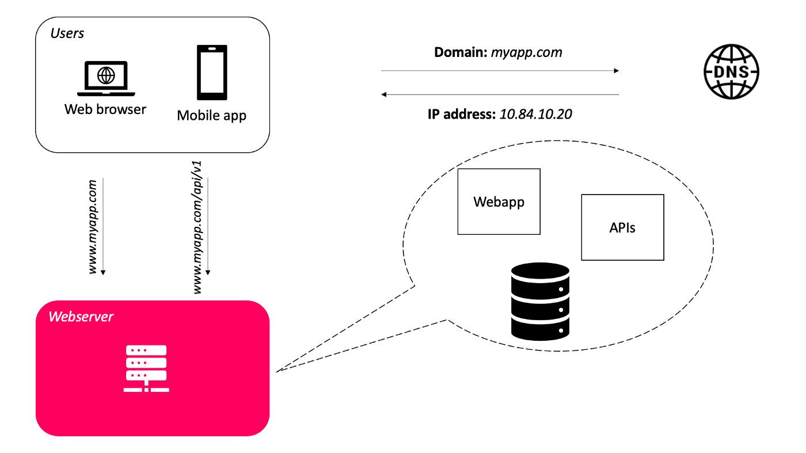
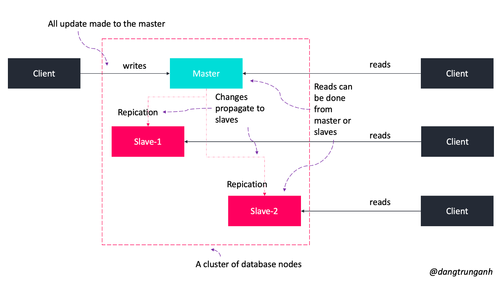
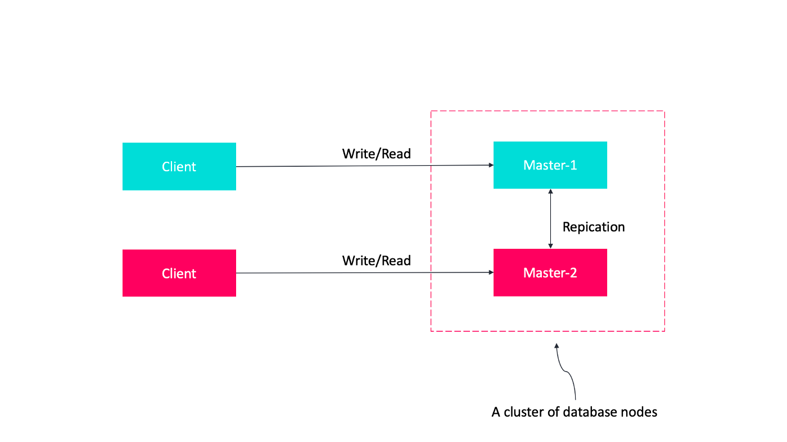
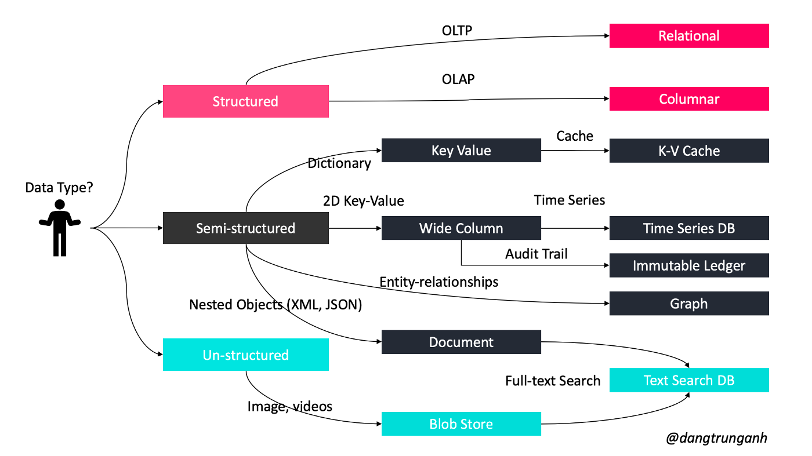
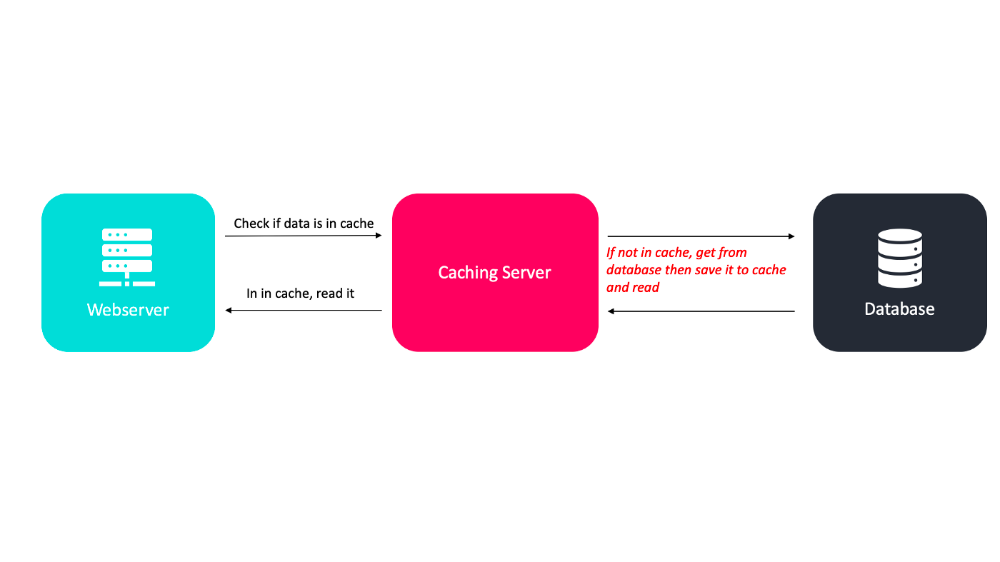
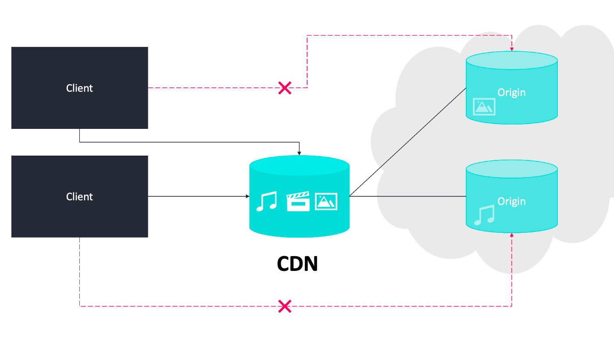

# How to design a system to scale to your first 100 million users
## Start from scratch
- Start by designing a basic app with some users.
- The simplest way is to deploy the entire app on a single server.
  - A website (include APIs) is running on a webserver like Apache
  - A database like Oracle
- Clients connect to the DNS system to obtain the Internet Protocol (IP) address of the server where our system is hosted. Once the IP address is obtained, the requests are sent directly to our system.
- Domain Name System (DNS) server is used as a paid service provided by the hosting company and is not running on your own server.

- Disadvantages:
  - If the database fails, the system fails
  - If the webserver fails, the entire system fails
- We don’t have failover and redundancy. If a server goes down, all goes down.
## The Art of Scalability
- Scalability usually means an ability to handle more users, clients, data, transactions, or requests without affecting the user experience by adding more resources.
### Scaling up
- There are many ways to scale vertically
  - Adding more I/O capacity by adding more hard drives in RAID arrays.
  - Improving I/O access times by switch to solid-state drivers (SSDs).
  - Switching to a server with more processors.
  - Improving network throughput by upgrading network interfaces or installing additional ones.
  - Reducing I/O operations by increasing RAM.
- Vertical scaling is a good option for small systems and can afford the hardware upgrade but it also comes with serious limitations as follows
  - It’s impossible to add unlimited power to a single server
  - When we upgrade RAM to the system, we must shut down the server and so, if the system just has one server, downtime is unavoidable
  - Powerful machines usually cost a lot more than popular hardware
- Scaling up not only applies to hardware terms but also in software terms,  for example, it includes optimizing queries and application code
- With the growth of the number of users, one server is never enough
- There are some advantages when adding more servers:
  - The webserver can be tuned differently than the database server
  - A webserver needs a better CPU and a database server thrives on more RAM
  - Using separate servers for the web tier and data tier allows them to scale independently of each other
### Scaling out
- We add more entities (machines, services) to our pool of resources.
- Horizontal scaling often initially costs more because we need more servers for the most basic, but it pays off at the later stage
- Increasing the number of servers means that more resources need to be maintained.
- The code of the system also needs changes to allow parallelism and distribution of work among multiple servers.
### Using load a balancer to balance the traffic across all nodes
- A load balancer is a specialized hardware or software component that helps to spread the traffic across a cluster of servers to improve responsiveness and availability of the system using various algorithms.
- It can be used in various places, for example; between the Web Servers and the Database servers and also between the Client and the Web Servers.
- HAProxy and NGINX are two popular open-source load balancing software.
- If server 1 goes offline, all the traffic will be routed to server 2 and server 3. The website won’t go offline. You also need to add a new healthy server to the server pool to balance the load.
- When the traffic is growing rapidly, you only need to add more servers to the web server pool and the load balancer will route the traffic for you.
- Load balancers employ various policies and work distribution algorithms to optimally distribute the load as follows
  - Round robin: each server receives requests in sequential order
  - Least number of connections: the server with the lowest number of connections will be directed to the request
  - Fastest response time: the server that has the fastest response time (either recently or frequently) will be directed to the request
  - Weighted: the more powerful servers will receive more requests than the weaker ones
  - IP Hash: a hash of the IP address of the client is calculated to redirect the request to a server
- Software load balancing is a cheap alternative to hardware load balancers. It operates at layer 4 (network layer) and layer 7 (application layer)
  - Layer 4: the load balancer uses the information provided by TCP at the network layer. At this layer, it usually selects a server without looking at the content of the request.
  - Layer 7: the requests can be balanced based on information in the query string, cookies, or any header we choose as well as the regular layer information including source and destination addresses.
### Scaling a relational database
- Relational database systems come with their challenges, especially when we need to scale them.
- There are many techniques to scale a relational database: master-slave replication, master-master replication, federation, sharding, denormalization, and SQL tuning
  - Replication usually refers to a technique that allows us to have multiple copies of the same data stored on different machines.
  - Federation (or functional partitioning) splits up databases by function
  - Sharding is a database architecture pattern related to partitioning by putting different parts of the data onto different servers and the different user will access different parts of the dataset
  - Denormalization attempts to improve read performance at the expense of some write performance by coping of the data are written in multiple tables to avoid expensive joins..
  - SQL tuning.
#### Master-slave replication
- The master-slave replication technique enables data from one database server (the master) to be replicated to one or more other database servers (the slaves) like in the below figure.

- A client would connect to the master and update data
- The data would then ripple through the slaves until all the data is consistent across the servers
- Bottleneck:
  - If the master server goes down for whatever reason, the data will still be available via the slave, but new writes won’t be possible.
  - We need an additional algorithm to promote a slave to a master.
- Some solutions to implement only one server can handle update requests:
  - Synchronous solutions: the data modifying transaction is not committed until accepted by all servers (distributed transaction), so no data lost on failover.
  - Asynchronous solutions: commit -> delay -> propagation to other servers in the cluster, so some data updates may be lost on failover -> faster than synchronous
#### Master-master replication
- Each database server can act as the master at the same time as other servers are being treated as masters. At some point in time, all of the masters sync up to make sure that they all have correct and up-to-date data.

- Advantages:
  - If one master fails, the other database servers can operate normally
  - Masters can be located in several physical sites and can be distributed across the network.
#### Federation
- Federation (or functional partitioning) splits up databases by function
- For example, instead of a single, monolithic database, you could have three databases: forums, users, and products, resulting in less read and write traffic to each database and therefore less replication lag.
- Smaller databases result in more data that can fit in memory, which in turn results in more cache hits due to improved cache locality. 
- With no single central master serializing writes you can write in parallel, increasing throughput.
#### Sharding
- Sharding (also known as data partitioning), is a technique to break up a big database into many smaller parts such that each database can only manage a subset of the data.
- It helps to improve the manageability, performance, availability, and load balancing of a system.
##### Horizontal partitioning
- Put different rows into different tables
##### Vertical partitioning
- Divide our data to store tables related to a specific feature in their own server.
- For example, if we are building an Instagram-like system — where we need to store data related to users, photos they upload, and people they follow — we can decide to place user profile information on one DB server, friend lists on another, and photos on a third server.
##### Directory based partitioning
- A loosely coupled approach to this problem is to create a lookup service that knows your current partitioning schema and keeps a map of each entity and which database shard it is stored on.
##### Limit of sharding
- There are some common problems with Sharding techniques as follows:
  - Database joins become more expensive and not feasible in certain cases
  - Sharding can compromise database referential integrity
  - Database schema changes can become extremely expensive
  - The data distribution is not uniform and there is a lot of load on a shard
#### Denormalization
- Denormalization attempts to improve read performance at the expense of some write performance
- Redundant copies of the data are written in multiple tables to avoid expensive joins -> need for complex join in sharding
- Some RDBMS such as PostgreSQL and Oracle support materialized views which handle the work of storing redundant information and keeping redundant copies consistent
##### Blob databases
- Blobs are more like a key/value store for files and are accessed through APIs like Amazon S3, Google Cloud Storage, ...
#### How to choose which database to use?

### Scaling the web tier horizontally
- We must choose stateless architecture whenever possible because the implementation of state limits scalability, decreases availability, and increase the cost.
### Caching
- Caching will enable you to make vastly better use of the resources you already have, so that the data may be served faster during subsequent requests.

- By adding caches to our servers, we can avoid reading the webpage or data directly from the server, thus reducing both the response time and the load on our server.
- This helps in making our application more scalable.
- Caching can be applied at many layers such as the database layer, web server layer, and network layer.
### Content Delivery Network (CDN)
- The CDN servers keep cached copies of the content (such as images, web pages, etc.) and serve them from the nearest location.
- The use of CDN improves page load time for users as the data is retrieved at a location closest to it. 
- This also helps in increasing the availability of content, since it is stored at multiple locations.

- The CDN servers make requests to our Web server to validate the content being cached and update them if required.
- The content being cached is usually static such as HTML pages, images, JavaScript files, CSS files, etc.
### Go Global
- When your app goes global, you will own and operating data centers around the world to keep your products running 24 hours a day, 7 days a week
- Incoming requests are routed to the “best” data center based on GeoDNS
- GeoDNS is a DNS service that allows domain names to be resolved to IP addresses based on the location of the customer
- A client connecting from Asia may get a different IP address than the client connecting from Europe.
## Putting it all together
- Applying all these techniques iteratively, we can easily scale the system to more than 100 million users such as stateless architecture, apply load balancer, use cache data as much as you can, support multiple data centers, host static assets on CDN, scale your data tier by sharding., etc.