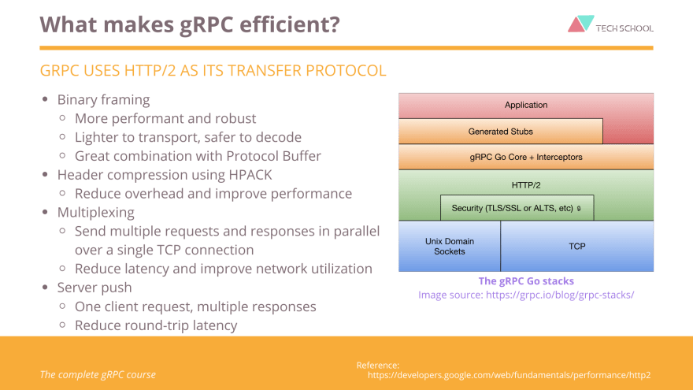
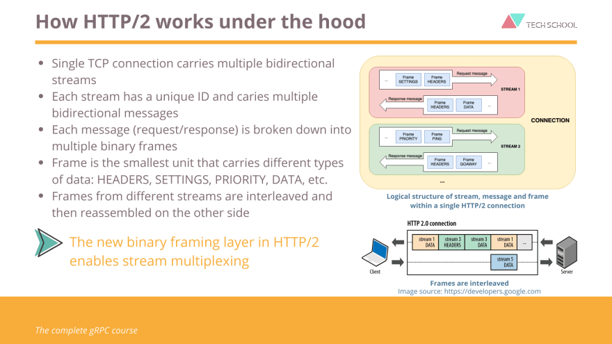
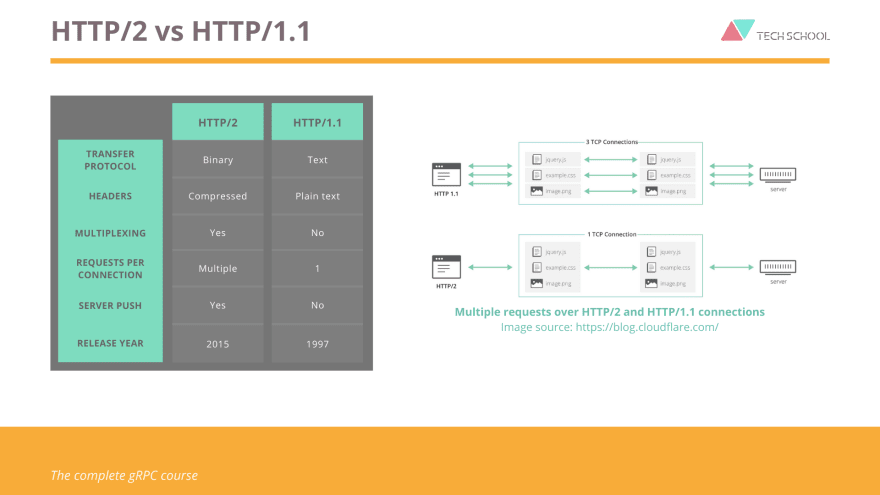

# HTTP/2 - The secret weapon of gRPC
---
## What makes gRPC efficient with HTTP/2?

## How HTTP/2 works under the hood?

## HTTP/2 vs HTTP/1.1

## Reference
- [HTTP/2 - The secret weapon of gRPC
](https://dev.to/techschoolguru/http-2-the-secret-weapon-of-grpc-32dk#:~:text=gRPC%20uses%20HTTP%2F2%20as,great%20combination%20with%20protocol%20buffer.)