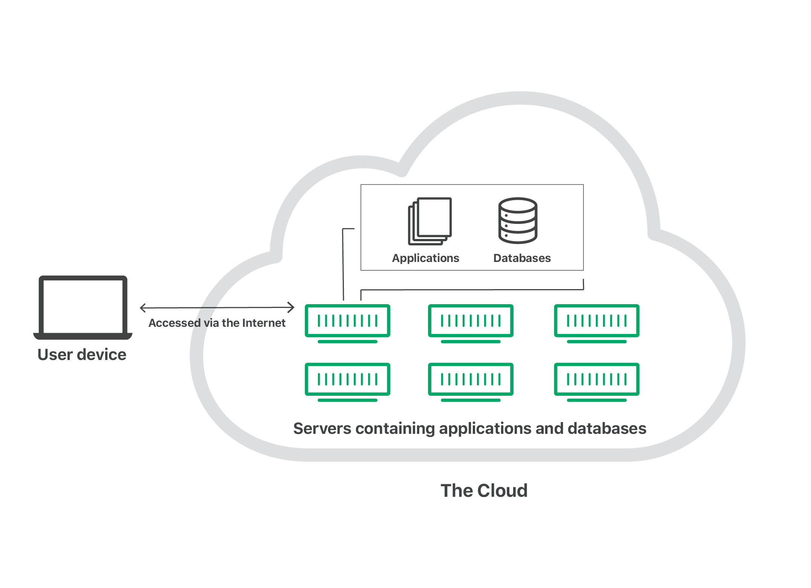
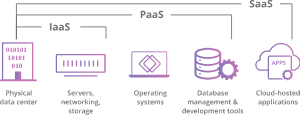

# What is the cloud?
## Introduction
- "The cloud" refers to servers that are accessed over the Internet, and the software and databases that run on those servers.
- 
- Cloud servers are located in data centers all over the world.
- A data center is a facility housing many networked computers that work together to process, store, and share data. Most major tech companies rely heavily upon data centers as a central component in delivering online services.
- By using cloud computing, users and companies do not have to manage physical servers themselves or run software applications on their own machines.
- The cloud enables users to access the same files and applications from almost any device, because the computing and storage takes place on servers in a data center, instead of locally on the user device.
- For businesses, switching to cloud computing removes some IT costs and overhead: for instance, they no longer need to update and maintain their own servers, as the cloud vendor they are using will do that.
- The cloud can also make it easier for companies to operate internationally, because employees and customers can access the same files and applications from any location.
## How does cloud computing work?
- Cloud computing is possible because of a technology called virtualization
- Virtualization allows for the creation of a simulated, digital-only "virtual" computer that behaves as if it were a physical computer with its own hardware.The technical term for such a computer is virtual machine.
- Virtual machines on the same host machine are sandboxed from one another, so they do not interact with each other at all, and the files and applications from one virtual machine are not visible to the other virtual machines even though they are on the same physical machine.
- Virtual machines also make more efficient use of the hardware hosting them
  - By running many virtual machines at once, one server becomes many servers, and a data center becomes a whole host of data centers, able to serve many organizations
  - Cloud providers can offer the use of their servers to far more customers at once
- If individual servers go down, cloud servers in general should be always online and always available. 
- Cloud vendors generally back up their services on multiple machines and across multiple regions.
- Users access cloud services either through a browser or through an app, connecting to the cloud over the Internet — that is, through many interconnected networks — regardless of what device they are using.
## What are the main service models of cloud computing?
- Define how services are offered via the cloud

- Software-as-a-Service (SaaS):
  - Instead of users installing an application on their device, SaaS applications are hosted on cloud servers, and users access them over the Internet. 
  - Examples of SaaS applications include Salesforce, MailChimp, and Slack.
- Platform-as-a-Service (PaaS):
  - Companies don't pay for hosted applications; instead they pay for the things they need to build their own applications. 
  - PaaS vendors offer everything necessary for building an application, including development tools, infrastructure, and operating systems, over the Internet.
  - PaaS examples include Heroku and Microsoft Azure.
- Infrastructure-as-a-Service (IaaS):
  - Company rents the servers and storage they need from a cloud provider. They then use that cloud infrastructure to build their applications.
  - IaaS is like a company leasing a plot of land on which they can build whatever they want — but they need to provide their own building equipment and materials.
  - IaaS providers include DigitalOcean, Google Compute Engine, and OpenStack.
- Function-as-a-Service (FaaS):
  - Known as serverless computing, breaks cloud applications down into even smaller components that only run when they are needed.
  - FaaS or serverless applications still run on servers, as do all these models of cloud computing.
  - But they are called "serverless" because they do not run on dedicated machines, and because the companies building the applications do not have to manage any servers
## What are the different types of cloud deployments?
- Defines where the cloud servers are and who manages them
- Private cloud:
  - A server, data center, or distributed network wholly dedicated to one organization
- Public cloud:
  - A service run by an external vendor that may include servers in one or multiple data centers
  - Unlike a private cloud, public clouds are shared by multiple organizations
  - Using virtual machines, individual servers may be shared by different companies
  - "multitenancy": multiple tenants are renting server space within the same server
- Hybrid cloud
  - Combine public and private clouds, and may even include on-premises legacy servers
  - An organization may use their private cloud for some services and their public cloud for others, or they may use the public cloud as backup for their private cloud
- Multi-cloud
  - Multi-cloud is a type of cloud deployment that involves using multiple public clouds.
  - An organization with a multi-cloud deployment rents virtual servers and services from several external vendors
  - Multi-cloud deployments can also be hybrid cloud, and vice versa
## How does Cloudflare help businesses move to and operate in the cloud?
- Cloudflare helps protect and manage any type of cloud deployment
- Cloudflare sits in between end users and the cloud infrastructure of the customer's product or service
- Customers can manage performance, security, DNS, and other Cloudflare offerings for all their cloud deployments from a single dashboard
## How is the cloud different from the traditional client-server model of the Internet?
- Cloud computing differs from this model in that cloud servers aren't just responding to requests — they're running programs and storing data on the client's behalf
## Are containers IaaS, PaaS, SaaS, or FaaS?
- Like virtual machines, containers are a cloud virtualization technology. 
- They are part of the PaaS (Platform-as-a-Service) cloud model. Virtualization for containers occurs one abstraction layer up from where it occurs for virtual machines, at the operating system level instead of at the kernel level (the kernel is the foundation of the operating system, and it interacts with the computer's hardware). Each virtual machine has its own operating system kernel, but containers on the same machine share the same kernel
- Virtualization for containers occurs one abstraction layer up from where it occurs for virtual machines, at the operating system level instead of at the kernel level
- Each virtual machine has its own operating system kernel, but containers on the same machine share the same kernel 
## What is the difference between a data center and a point-of-presence (PoP)?
- A PoP may refer to a company having a single server presence in a location while a data center may refer to a location that houses multiple servers
- A data center refers to a physical location in which computers are networked together in order to improve usability and reduce costs related to storage, bandwidth, and other networking components
## What are the common concerns in the design of a data center?
- With proper planning, maintenance, and security, a data center is at lower risk of both downtime and data breaches:
  - Redundancy/backup - the level of redundancy varies widely based on the quality of a data center; in high tier data centers, multiple redundancies in power and backup servers are built into the infrastructure
  - Efficiency - Whenever possible, data centers attempt to cut down on costs by optimizing cooling processes and using energy-efficient hardware
  - Security - proper physical security, both in terms of electronic surveillance, access controls, and on-site security guards reduce the risk associated with bad actors attempting to gain site access
  - Environmental controls/factors 
    - Maintaining the right environmental conditions is necessary for the proper functioning of electronic hardware
    - Keeping both temperature and humidity within acceptable parameters requires the proper balance of air conditioning, humidity control, and airflow regulation. 
    - In areas that are vulnerable to earthquakes, properly secured servers are also a necessary concern
  - Maintenance and monitoring
    - On-site or on-call network engineers are needed in order stay on top of server crashes and other hardware failures
    - Proper response helps to ensure server uptime and eliminate reductions in quality of service
  - Bandwidth
    - A data center is incomplete without the bandwidth necessary to handle all the requisite network traffic
    - Bandwidth considerations are a central component in data center infrastructure, with external network connections and internal data center topology both designed around sufficient network capacity
    
## Ref
- https://www.youtube.com/watch?v=i9x0UO8MY0g
- https://www.cloudflare.com/learning/cloud/what-is-the-cloud/
- https://www.cloudflare.com/learning/cdn/glossary/data-center/