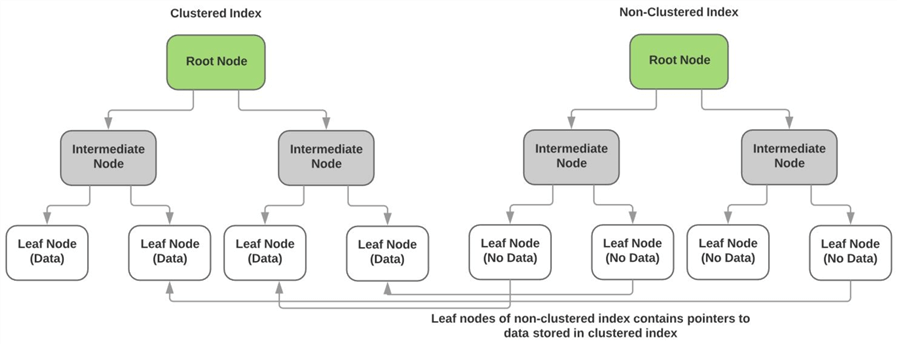
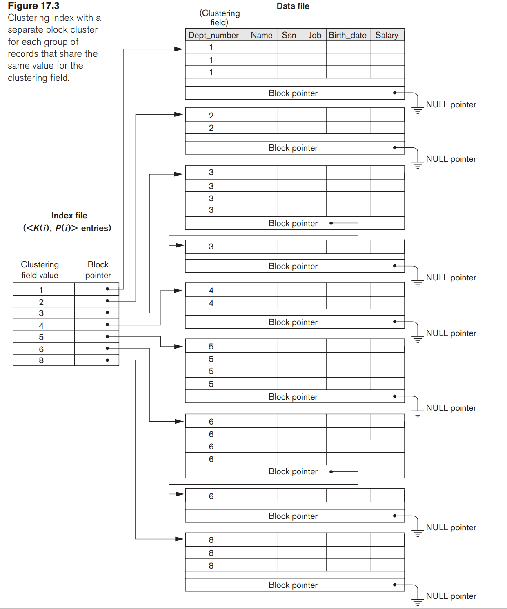
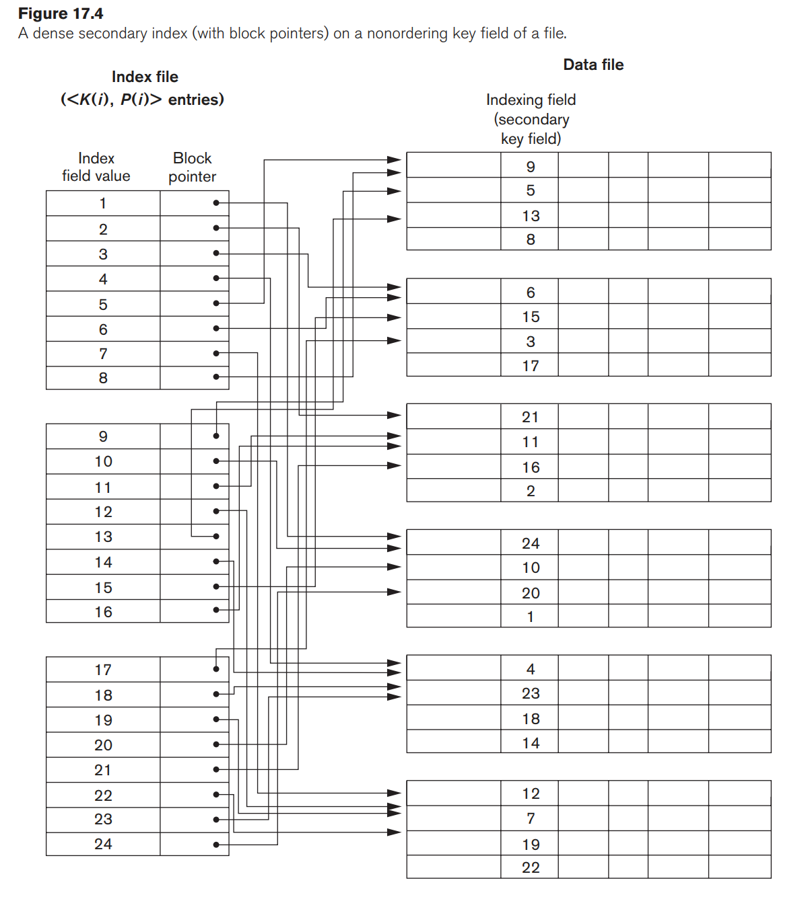
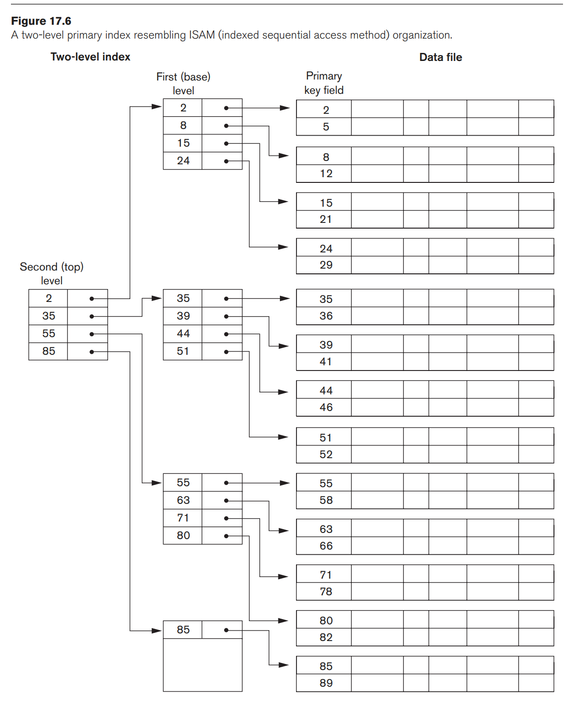

# Indexing

## Clustered vs Non-clustered Indexes

- **Clustered Indexes**: Physically orders the data according to the indexed columns. Typically, data themselves are physically stored in a B-Tree. The root and intermediate nodes point to other intermediate or leaf node. The leaf nodes contain the data of record in the table.
- **Non-clustered Indexes**: Data is not physically stored in the order of the index. Indices are stored in a separated B-Tree. The root and intermediate nodes point to other intermediate or leaf nodes. The leaf nodes contain the pointer to the actual data.

## Single-Level Ordered Indexes

- **Primary index**: specified on the ordering key field of an ordered file of records
- **Clustering index**: specified on the ordering non-key field of an ordered file of records
- A file can have at most one physical ordering field, so it can have **either primary index or clustering index**
- **Secondary index**: specified on a field that is a candidate key and has a unique value in every record, or on a nonkey field with duplicate values
- **Primary index** and **Clustering index** *can be (not necessarily)* used with **Clustered index**

## Multi-Level Indexes

Use B-Tree and B+-Tree for better searching

## Indexing Practice

- [How to Design Indexes](https://www.slideshare.net/billkarwin/how-to-design-indexes-really)
- [Nonclustered Indexes in SQL Server](https://www.mssqltips.com/sqlservertutorial/9133/sql-server-nonclustered-indexes)
- [Clustered Indexes in SQL Server](https://www.mssqltips.com/sqlservertutorial/9132/sql-server-clustered-indexes/)
