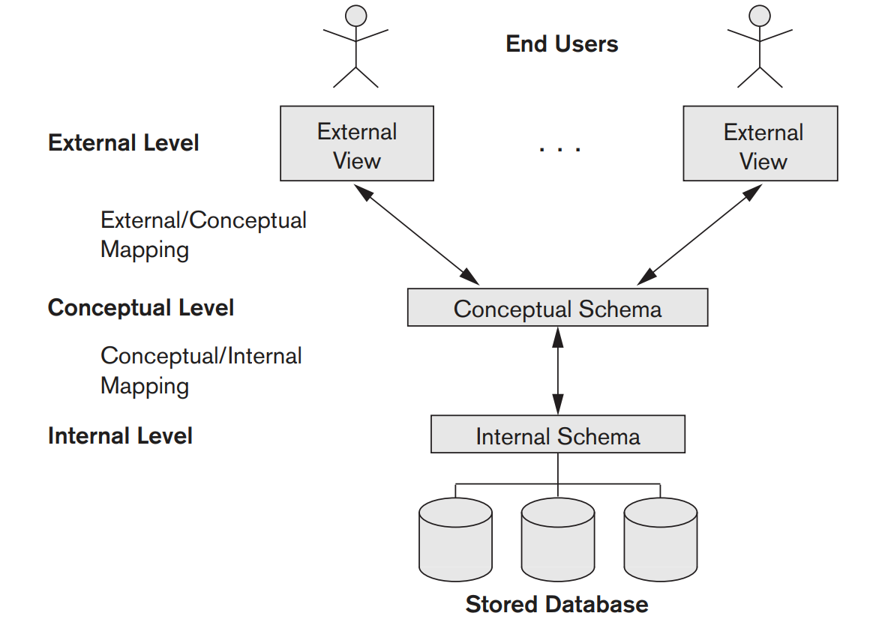

# Three-Schema Architecture

## Definition

The goal of the three-schema architectuer is to separate the user application from the physical database. In this architecture, schemas can be defined at the following three levels:

1. The internal level has an internal schema, which describes the physical storage structure of the database. The internal schema uses a physical data model and describes the complete details of data storage and access paths for the database.
2. The conceptual level has a conceptual schema, which describes the structure of the whole database for a community of users. The conceptual schema hides the details of physical storage structures and concentrates on describing entities, data types, relationships, user operations, and constraints. Usually, a representational data model is used to describe the conceptual schema when a database system is implemented. This implementation conceptual schema is often based on a conceptual schema design in a high-level data model
3. The external or view level includes a number of external schemas or user views. Each external schema describes the part of the database that a particular user group is interested in and hides the rest of the database from that user group. As in the previous level, each external schema is typically implemented using a representational data model, possibly based on an external schema design in a high-level conceptual data model.

## Data Independence

The three-schema architecture can be used to further make the concept of data independence work, which can be defined as the capacity to change the schema at one level of a database system without having to change the schema at the next higher level. We can define two types of data independence:

1. **Logical data independence** is the capacity to change the conceptual schema without having to change external schemas or application programs. We may change the conceptual schema to expand the database (by adding a record type or data item), to change constraints, or to reduce the database (by removing a record type or data item). In the last case, external schemas that refer only to the remaining data should not be affected.  Only the view definition and the mappings need to be changed in a DBMS that supports logical data independence. After the conceptual schema undergoes a logical reorganization, application programs that reference the external schema constructs must work as before. Changes to constraints can be applied to the conceptual schema without affecting the external schemas or application programs.
2. **Physical data independence** is the capacity to change the internal schema without having to change the conceptual schema. Hence, the external schemas need not be changed as well. Changes to the internal schema may be needed because some physical files were reorganized—for example, by creating additional access structures—to improve the performance of retrieval or update. If the same data as before remains in the database, we should not have to change the conceptual schema.

Generally, physical data independence exists in most databases and file environments where physical details, such as the exact location of data on disk, and hardware details of storage encoding, placement, compression, splitting, merging of records, and so on are hidden from the user. Applications remain unaware of these details. On the other hand, logical data independence is harder to achieve because it allows structural and constraint changes without affecting application programs—a much stricter requirement.

Whenever we have a multiple-level DBMS, its catalog must be expanded to include information on how to map requests and data among the various levels. The DBMS uses additional software to accomplish these mappings by referring to the mapping information in the catalog. Data independence occurs because when the schema is changed at some level, the schema at the next higher level remains unchanged; only the mapping between the two levels is changed. Hence, application programs referring to the higher-level schema need not be changed.