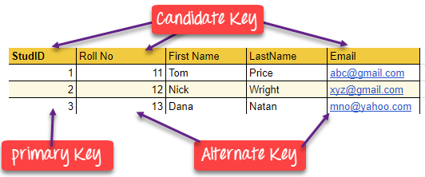

# Type of Keys in DBMS

## Super Key

A super key is a group of single or multiple keys which identifies rows in a table. A Super key may have additional attributes that are not needed for unique identification.

Example:

| EmpSSN | EmpNum | EmpName |
|:------:|:------:|:-------:|
| 123932 | AB05   | Shown   |
| 394828 | ZY07   | Roslyn  |
| 124920 | AT29   | James   |

In the above-given example, EmpSSN and EmpNum name are superkeys.

## Primary Key

A primary key is a column or group of columns in a table that uniquely identify every row in that table. The Primary Key can't be a duplicate meaning the same value can't appear more than once in the table. A table cannot have more than one primary key.

### Rules for defining primary key:

- Two rows can't have the same primary key value
- It must for every row to have a primary key value
- The primary key field cannot be null
- The value in a primary key column can never be modified or updated if any foreign key refers to that primary key

## Alternate Key

An alternate key is a column or group of columns in a table that uniquely identify every row in that table. A table can have multiple choices for a primary key but only one can be set as the primary key. All the keys which are not primary key are called an alternate key.

## Candidate Key

Candidate key is a set of attributes that uniquely identify tuples in a table. Candidate Key is a super key with no repeated attributes. The Primary key should be selected from the candidate keys. Every table must have at least a single candidate key. A table can have multiple candidate keys but only a single primary key.

### Properties of candidate key
- It must contain unique values
- Candidate key may have multiple attributes
- Must not contain null values
- It should contain minimum fields to ensure uniqueness
- Uniquely identify each record in a table

## Foreign Key

A foreign key is a column that creates a relationship between two tables. The purpose of Foreign keys is to maintain data integrity and allow navigation between two different instances of an entity. It acts as a cross-reference between two tables as it references the primary key of another table.

## Compound Key

Compound key has two or more attributes that allow you to uniquely recognize a specific record. It is possible that each column may not be unique by itself within the database. However, when combined with the other column or columns the combination of composite keys become unique. The purpose of the compound key in database is to uniquely identify each record in the table.

## Composite Key

Composite key is a combination of two or more columns that uniquely identify rows in a table. The combination of columns guarantees uniqueness, though individually uniqueness is not guaranteed. Hence, they are combined to uniquely identify records in a table.

The difference between compound and the composite key is that any part of the compound key can be a foreign key, but the composite key may or maybe not a part of the foreign key.

## Surrogate Key

A surrogate key is an artificial key which aims to uniquely identify each record is called a surrogate key. This kind of partial key in dbms is unique because it is created when you don't have any natural primary key. They do not lend any meaning to the data in the table. Surrogate key is usually an integer. A surrogate key is a value generated right before the record is inserted into a table.
