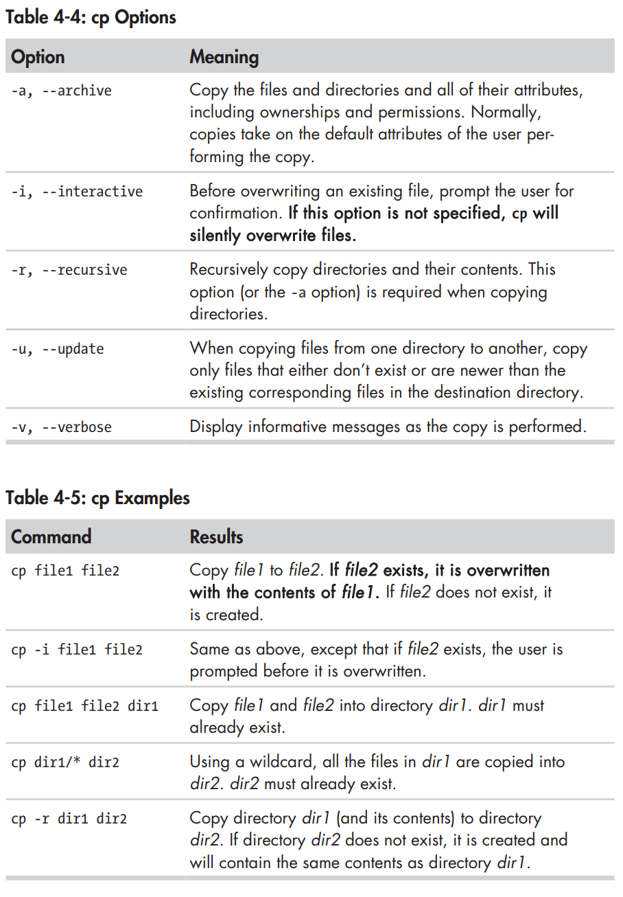
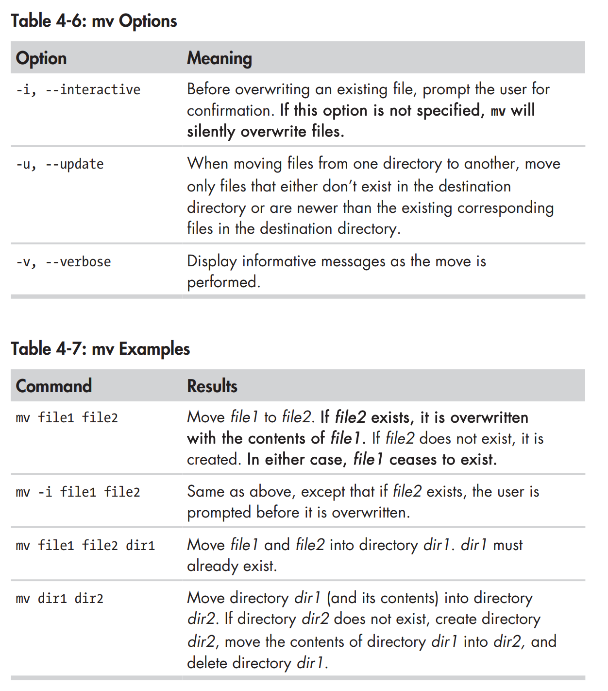
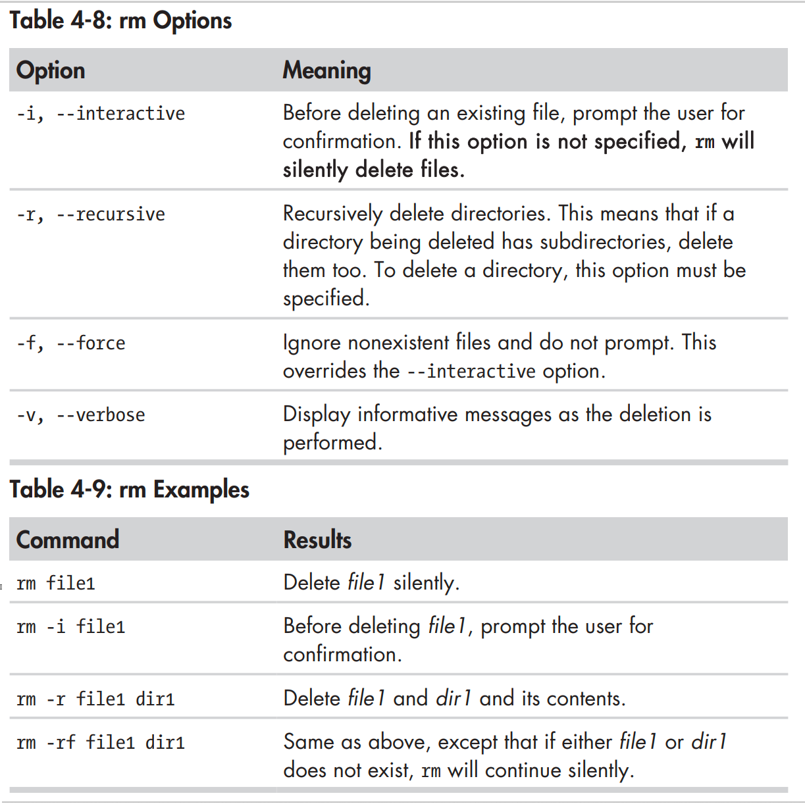
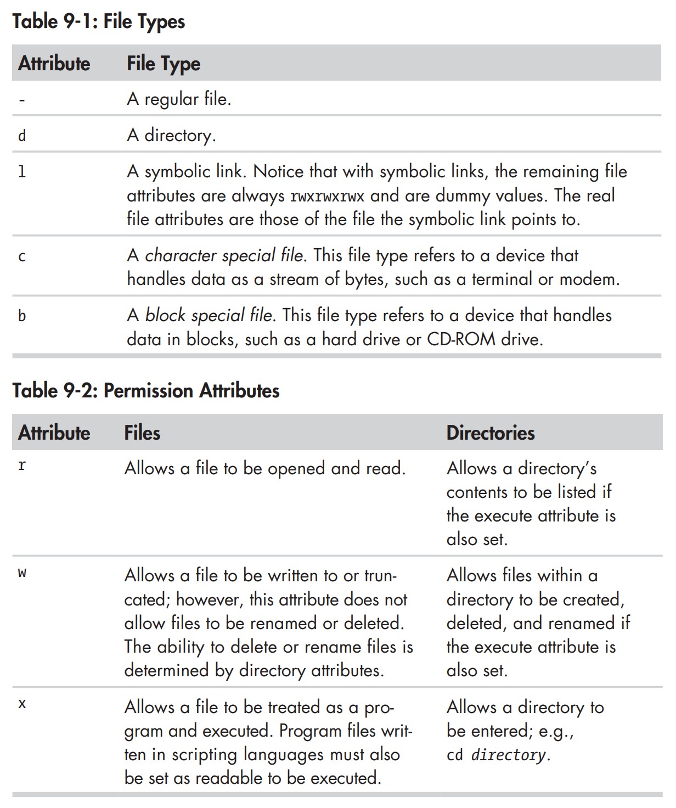

# Shell

## Commands

### Time & Date

- Get current date: `date`
- Show calendar: `cal`


### Navigation

- Go to `home` directory: `cd`
- Go to previous directory: `cd -`

### Exploring

- Get file type: `file <filename>`
- View file: `less <filename>`
  - Go to next page: `Space`
  - Go to previous page: `b`
  - Go to end of file: `G`
  - Go to begining of file: `g`
  - Search for keyword: `/<keyword>`
  - Next occurrence of the previous search: `n`
  - Cancel search: `Esc + U` (MacOS), `Alt + U` (Linux)
  - Quit: `q`
  
### Manipluating Files and Directories

- Copy Files and Directories: `cp`



- Move and Rename Files: `mv`



- Remove Files and Directories: `rm`



- Create Links: `ln`

### Redirection

- Truncating a file: `> <filename>`
- Redirecting Standard Output: `<exec>  > <filename>` (which is the same as `<exec> 2> <filename>`)
- Append Standard Error: `<exec> >> <filename>`
- Redirecting Standard Error: `<exec> 2> <filename>`
- Redirecting Standard Output and Standard Error to One File: `<exec> > <filename> 2>&1` ([learn more](https://www.brianstorti.com/understanding-shell-script-idiom-redirect)) or `<exec> &> <filename>`
- Disposing of Unwanted Output: `<exec> 2> <filename>`

### Pipeline

- Pipe one command's standard output to other command's standard input: `<exec1> | <exec2>`

### Command Substitution

Command substitution allows us to use the output of a command as an expansion. For example, `ls $(pwd)` will list the file and directory of current directory. It can also be rewritten in the form `` ls `pwd` ``.

### Quoting

#### Double Quotes

This means that word splitting, pathname expansion, tilde expansion, and brace expansion are suppressed, but parameter expansion, arithmetic expansion, and command substitution are still carried out.

```
[me@linuxbox ~]$ echo "$USER $((2+2)) $(cal)"
me 4 February 2012
Su Mo Tu We Th Fr Sa
          1  2  3  4
 5  6  7  8  9 10 11
12 13 14 15 16 17 18
19 20 21 22 23 24 25
26 27 28 29
```

```
[me@linuxbox ~]$ echo this is a test
this is a test
```

```
[me@linuxbox ~]$ echo "this is a test"
this is a test
```

#### Single Quotes

If we need to suppress all expansions, we use single quotes. Here is a comparison of unquoted, double quotes, and single quotes:

```
[me@linuxbox ~]$ echo text ~/*.txt {a,b} $(echo foo) $((2+2)) $USER
text /home/me/ls-output.txt a b foo 4 me
[me@linuxbox ~]$ echo "text ~/*.txt {a,b} $(echo foo) $((2+2)) $USER"
text ~/*.txt {a,b} foo 4 me
[me@linuxbox ~]$ echo 'text ~/*.txt {a,b} $(echo foo) $((2+2)) $USER'
text ~/*.txt {a,b} $(echo foo) $((2+2)) $USER
```

#### Escaping Characters

- We can precede a character with a backslash, which in this context is called the escape character to escape a single character

```
[me@linuxbox ~]$ echo "The balance for user $USER is: \$5.00"
The balance for user me is: $5.00
```

### Permission

- Change file permissions: `chmod <permission> <filename>`

- Change file ownership and group: `chown [owner][:[group]] file...`