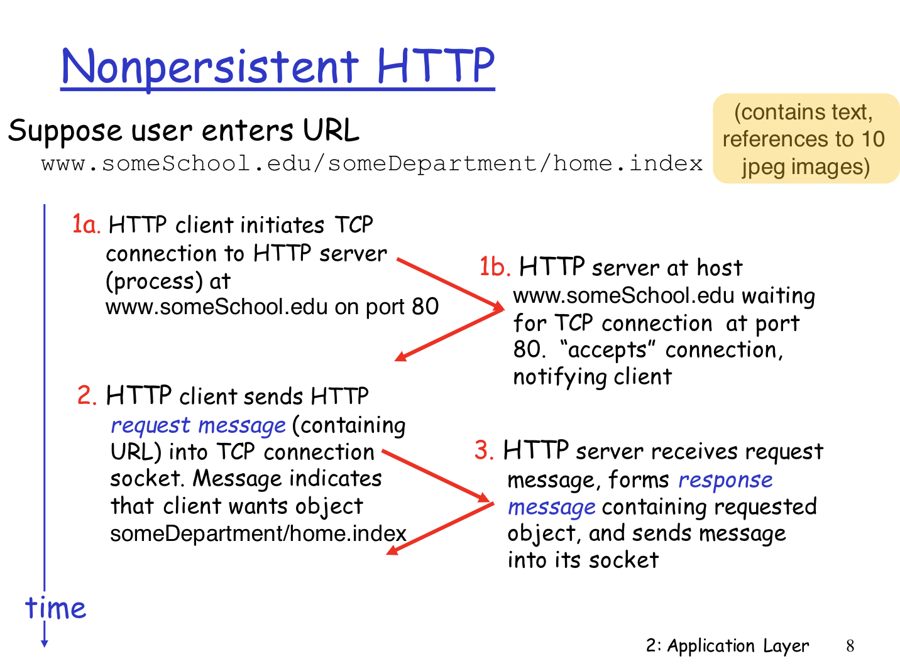
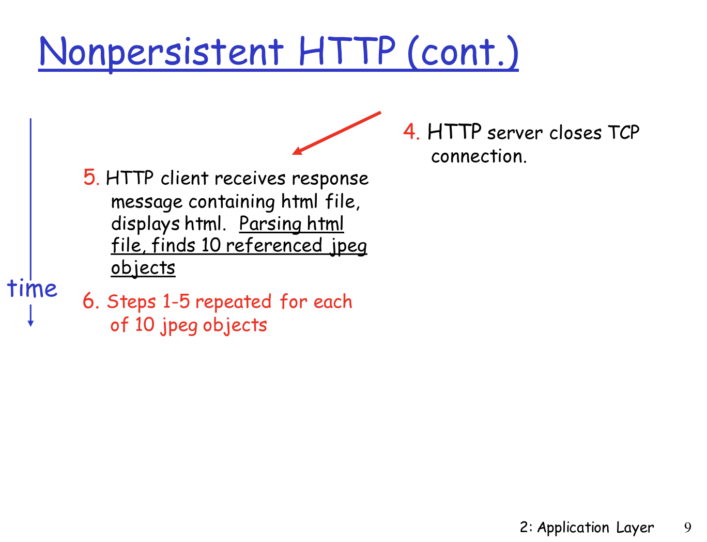
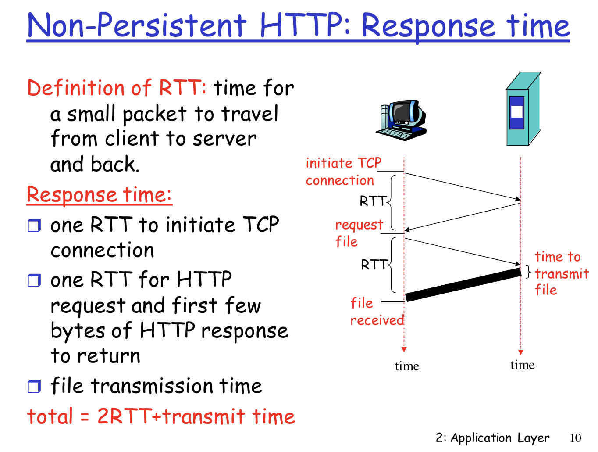
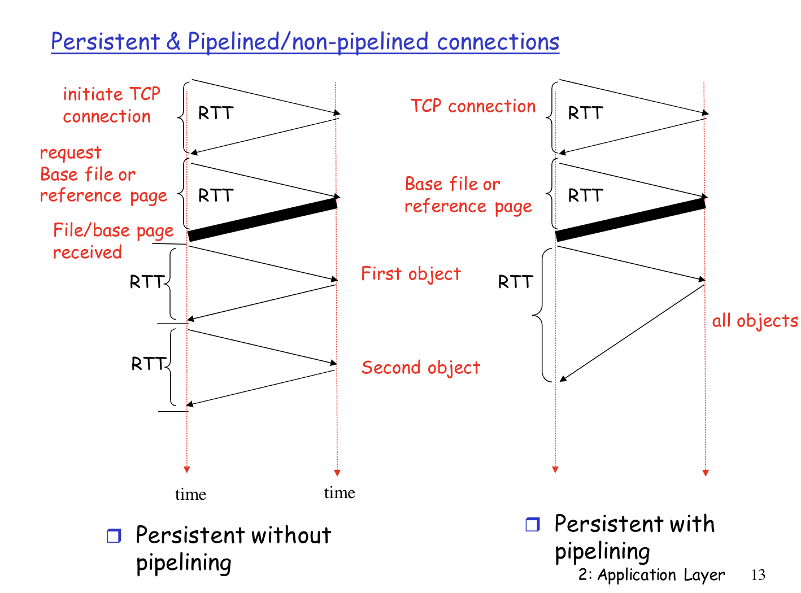

# Persistent Connection

## Concept

Persistent connection is a single TCP connection that remains open for many request/response.

## Non-persistent Connection vs. Persistent Connection

| Non-persistent | Persistent |
|---------------|------------|
| At most one object is sent over a single TCP connection | Multiple objects can be sent over a single TCP connection |
| Requires 2 RTTs per object (one for TCP handshake and one for the object itself). Server closes the connection once the client has received the response. OS overhead for each TCP connection | Server leaves connection open after sending response. Subsequent HTTP messages same client and server is sent over the open connection. Client sends requests as soon as it encounters a referenced object

### Non-persistent HTTP

#### Non-persistent HTTP with Parallel Connections

### Persistent HTTP

When Persistent HTTP uses pipelining, requests for objects can be made back-to-back, without waiting for replies to pending requests (pipelining). Typically, the HTTP server closes a connection when it isn’t used for a certain time (a configurable timeout interval). When the server receives the back-to-back requests, it sends the objects back-to-back. The default mode of HTTP uses persistent connections with pipelining.

### Practice Questions

**Questions**:

Assume that you have base HTML file with 30 embedded images, images & base file are small enough to fit in one TCP segment. How many RTT are required to retrieve base file & images under-following condition:
(i) Non-Persistent connection without parallel connection
(ii) Non-persistent connection with 10 parallel connection
(iii) Persistent connection without pipe-lining
(iv) Persistent connection with pipe-lining
(Assume RTT dominates all other time)

**Explanation**:

2RTT is the initial required connection one for TCP connection and one for HTML base file.

`total time = 2RTT + transmit time`.

**(i) Non-Persistent connection with no parallel connection**:

Here for each image 2 RTT are required one for TCP connection and one for image to send.  
So transmit time for 30 images = 2*(30 RTT) = 60 RTT  
Total time = 2 RTT+60 RTT = 62RTT

**(ii) Non-persistent connection with 10 parallel connection**:

Here 10 images can be send simultaneously.  
So for 30 images it required -> 2*(30/10) = 6RTT  
Total time = 2 RTT + 6 RTT = 8RTT

**(iii) Persistent connection without pipelining:**

Here TCP connection is required again and again.  
So for 30 images it requires -> 30 RTTs  
Total time = 2 RTT + 30 RTT = 32RTT

**(iv) Persistent connection with pipe-lining:**

Since it is persistent connection, TCP connection is not required again and again.  
In pipelining connection we can send all images in 1RTT.  
Total time = 2 RTT + 1 RTT = 3RTT

### Properties of Persistent Connection

#### MaxActiveConnection and MaxIdeConnection 

In small environments, connections to databases are not a problem, because there aren't so many connections, and server resources are almost intact.

In big environments, the number of connections to database consume a lot of resources, so, you need to optimize the manner you manage database connections, using the less possible number of connections will give you a better performance. In this point, maxActive set the max number of connections that can be made to the database by that pool, limiting the resources assigned to the requester. With maxIdle you specify that, if a connection "is idle" it will be closed, unless the number of idle connections is smaller or equal to "maxIdle". Why not less than maxIdle? Because you need some connections to be ready for next requests to the database, so you don't need to open and close again so many connections.

### References

- [Pipelining in Persistent HTTP](https://www.w3.org/Protocols/rfc2616/rfc2616-sec8.html)
- [HTTP Non-Persistent & Persistent Connection | Set 1](https://www.geeksforgeeks.org/http-non-persistent-persistent-connection/)
- [HTTP Non-Persistent & Persistent Connection | Set 2](https://www.geeksforgeeks.org/http-non-persistent-persistent-connection-set-2/?ref=rp)
