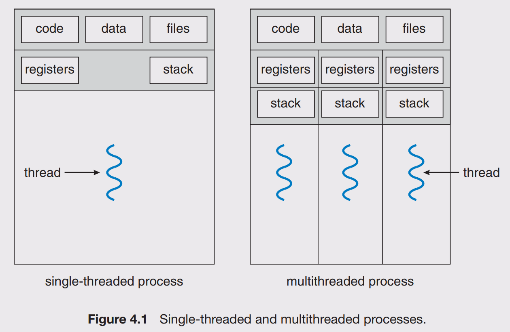

# Thread

## Kind of Thread

There are 3 kinds of thread:

- Hardware thread is a physical CPU or core. Typically, a 4 core CPU can genuinely support 4 hardware threads at once - the CPU really is doing 4 things at the same time. If a core has hyper-threading, there will be two hardware threads offered by single physical core.
- Kernel thread are implemented in kernel space and recognized by OS.
- User thread are implemented in user space and not recognized by OS.

## Composition

A thread has its own:

- Register set
- Program counter
- Stack

Threads of a process share:

- Text
- Heap
- Data

## Multithreading Models

- Many to One: The many-to-one model maps many user-level threads to one kernel thread. Thread management is done by the thread library in user space, so it is efficient. However, the entire process will block if a thread makes a blocking system call. Also, because only one thread can access the kernel at a time, multiple threads are unable to run in parallel on multicore systems. 

- One to One: The one-to-one model maps each user thread to a kernel thread. It provides more concurrency than the many-to-one model by allowing another thread to run when a thread makes a blocking system call. It also allows multiple threads to run in parallel on multiprocessors. The only drawback to this model is that creating a user thread requires creating the corresponding kernel thread. Because the overhead of creating kernel threads can burden the performance of an application, most implementations of this model restrict the number of threads supported by the system. Linux, along with the family of Windows operating systems, implement the one-to-one model. 

- Many to Many: N user threads are multiplexed to N kernel thread. Whereas the manyto-one model allows the developer to create as many user threads as she wishes, it does not result in true concurrency, because the kernel can schedule only one thread at a time. The one-to-one model allows greater concurrency, but the developer has to be careful not to create too many threads within an application (and in some instances may be limited in the number of threads she can create). The many-to-many model suffers from neither of these shortcomings: developers can create as many user threads as necessary, and the corresponding kernel threads can run in parallel on a multiprocessor. Also, when a thread performs a blocking system call, the kernel can schedule another thread for execution.

## Signal

A signal is a notification sent to a process in order to notify it of an event that occured. When the signal is sent, the OS interrupts the target process's normal flow of execution to deliver the signal. If the process has previously registered a signal handler, that routine is executed. Otherwise, the default signal handler is executed.
