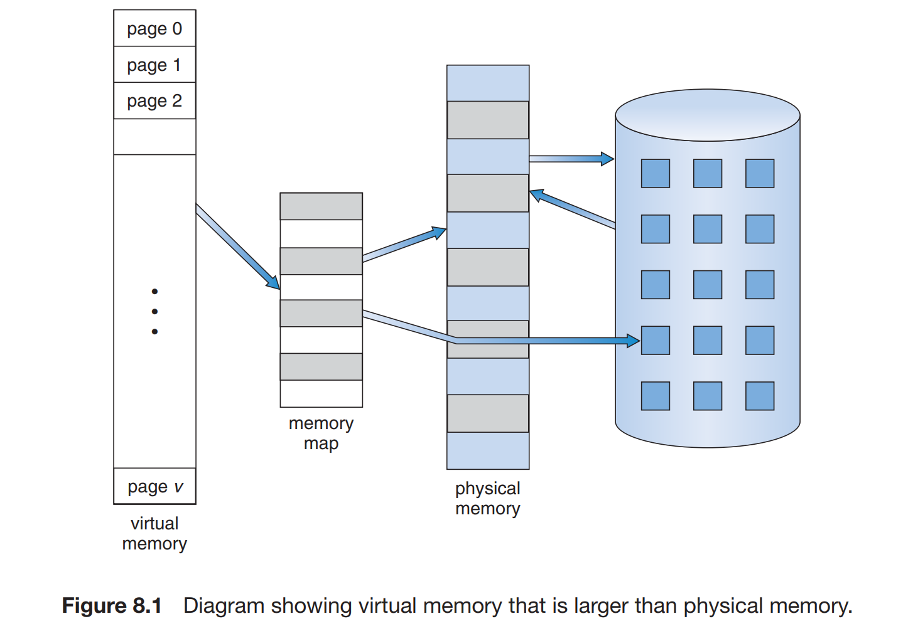

# Virtual Memory

Virtual memory involves the separation of logical memory as perceived by users from physical memory. This separation allows an extremely large virtual memory to be provided for programmers when only a smaller physical memory is available (Figure 8.1). Virtual memory makes the task of programming much easier, because the programmer no longer needs to worry about the amount of physical memory available; she can concentrate instead on the problem to be programmed.

The virtual address space of a process refers to the logical (or virtual) view of how a process is stored in memory. Typically, this view is that a process begins at a certain logical address—say, address 0—and exists in contiguous memory. Physical memory may be organized in page frames and that the physical page frames assigned to a process may not be contiguous. It is up to the memory management unit (MMU) to map logical pages to physical page frames in memory.

## Demand Paging

With demand-paged virtual memory, pages are loaded only when they are demanded during program execution. Pages that are never accessed are thus never loaded into physical memory. When we want to execute a process, we swap it into memory. Rather than swapping the entire process into memory, though, we use a lazy swapper. A lazy swapper never swaps a page into memory unless that page will be needed. In the context of a demand-paging system, use of the term “swapper” is technically incorrect. A swapper manipulates entire processes, whereas a pager is concerned with the individual pages of a process. We thus use “pager,” rather than “swapper,” in connection with demand paging.

## Page Replacement

Page replacement decides which page to remove, also called swap out when a new page needs to be loaded into the main memory. Page replacement happens when a requested page is not present in the main memory and the available space is not sufficient for allocation to the requested page.

A page replacement algorithm tries to select which pages should be replaced so as to minimize the total number of page misses. There are many different page replacement algorithms, including:

- First In First Out (FIFO)
- Least Recently Used (LRU)
- Optimal Page Replacement (OPR)

## Frame Allocation

### Global vs Local Allocation

Global replacement allows a process to select a replacement frame from the set of all frames, even if that frame is currently allocated to some other process; that is, one process can take a frame from another. Local replacement requires that each process select from only its own set of allocated frames.

One problem with a global replacement algorithm is that a process cannot control its own page-fault rate. The set of pages in memory for a process depends not only on the paging behavior of that process but also on the paging behavior of other processes. Therefore, the same process may perform quite differently (for example, taking 0.5 seconds for one execution and 10.3 seconds for the next execution) because of totally external circumstances. Such is not the case with a local replacement algorithm. Under local replacement, the set of pages in memory for a process is affected by the paging behavior of only that process.

However, local replacement might hinder a process by not offering less used frames from the set of all frames. Thus, global replacement generally results in greater system throughput and is therefore the more commonly used method.

## Thrashing

Now if it happens that your system has to swap pages at such a higher rate that major chunk of CPU time is spent in swapping then this state is known as thrashing. So effectively during thrashing, the CPU spends less time in some actual productive work and more time in swapping, which leads to decrease of CPU utilization.

